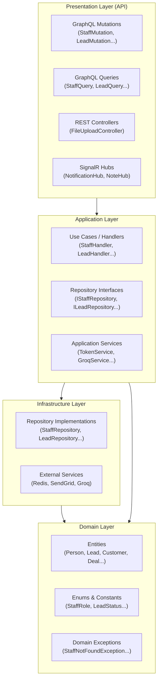
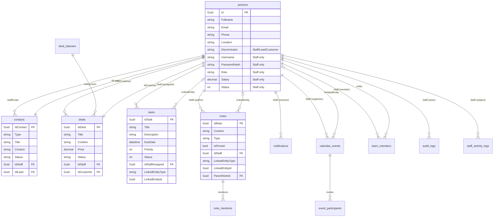
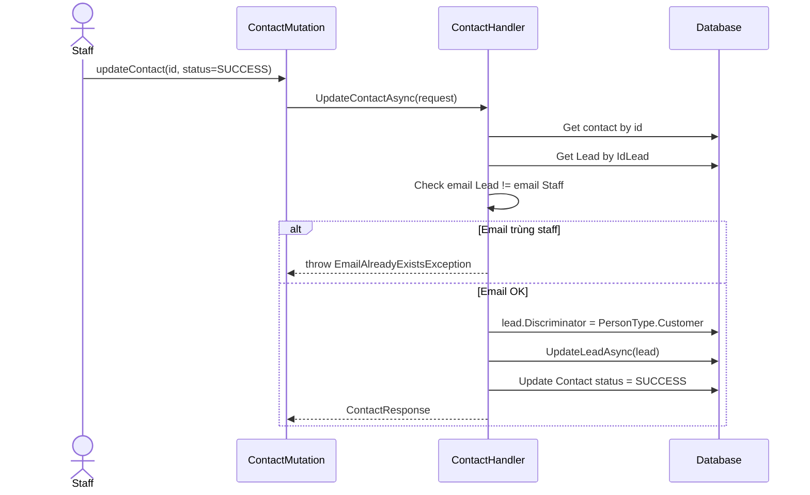
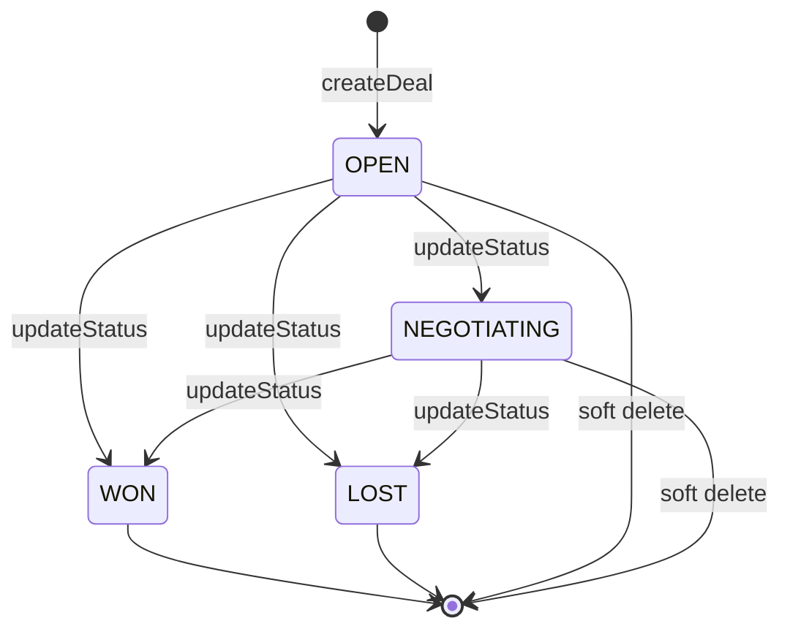
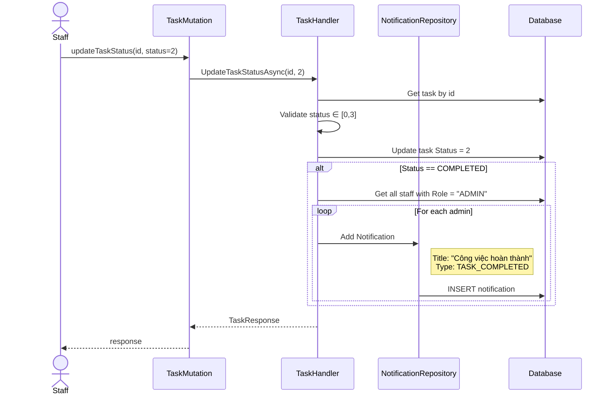
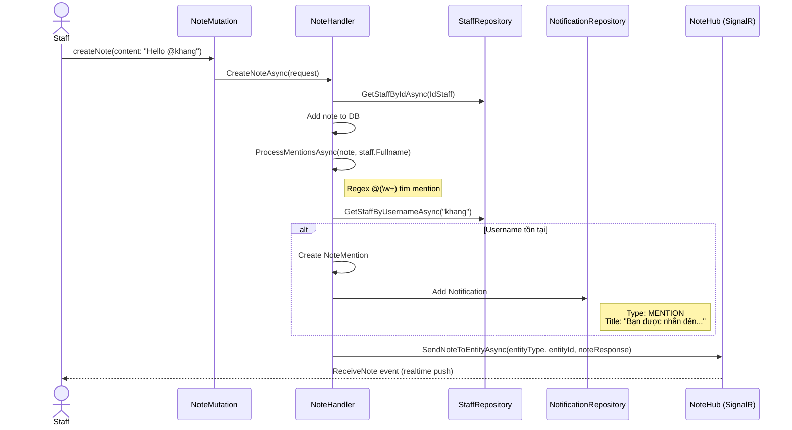
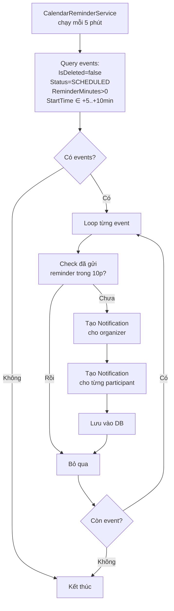
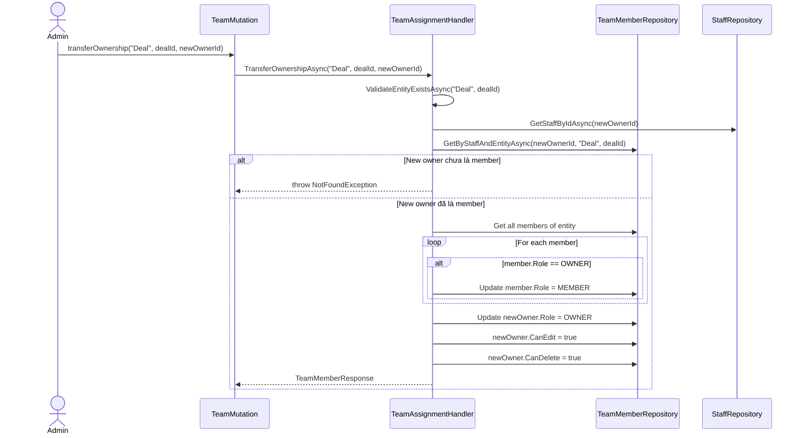
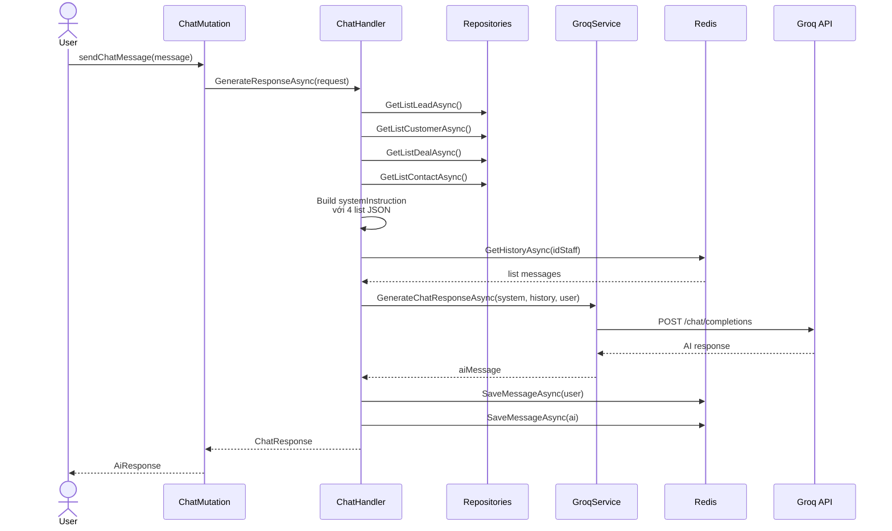

# BÁO CÁO THỰC TẬP DOANH NGHIỆP

**ĐỀ TÀI: XÂY DỰNG HỆ THỐNG CRM (CUSTOMER RELATIONSHIP MANAGEMENT) CHO DOANH NGHIỆP BẤT ĐỘNG SẢN VỚI ASP.NET CORE VÀ GRAPHQL**

---

**Công ty thực tập:** Công ty TNHH Phần mềm ABC
**Người phụ trách:** ThS. Nguyễn Văn A — Senior Backend Engineer
**Thực tập sinh:** Nguyễn Tiến Khang
**MSSV:** [Mã số sinh viên]
**Lớp:** [Lớp]

---

TP. Hồ Chí Minh, tháng 6 năm 2026

---

## LỜI MỞ ĐẦU

Trong cuộc cách mạng công nghiệp 4.0, công nghệ thông tin nói chung và ngành Công nghệ phần mềm nói riêng luôn là nhân tố đóng vai trò quan trọng trong quá trình phát triển của xã hội. Công nghệ Web, hay công nghệ sản xuất các trang web đã phục vụ hầu hết các nhu cầu của con người từ bán hàng, cung cấp kiến thức đến thông tin liên lạc. Hiện nay đã có đến hơn 1.5 tỷ trang web, nhưng nhu cầu tạo ra những trang web mới vẫn chưa có dấu hiệu giảm.

Cùng với sự phát triển mạnh mẽ của thị trường bất động sản Việt Nam, nhu cầu quản lý khách hàng của các doanh nghiệp kinh doanh trong lĩnh vực này ngày càng trở nên phức tạp. Một hệ thống CRM (Customer Relationship Management) không chỉ giúp doanh nghiệp lưu trữ thông tin khách hàng mà còn hỗ trợ theo dõi pipeline bán hàng, tự động hóa quy trình chăm sóc khách hàng tiềm năng, và cung cấp các báo cáo thống kê giúp ban lãnh đạo đưa ra quyết định kinh doanh chính xác hơn.

Do đó, một trang web muốn được nhiều người sử dụng phải đáp ứng được yếu tố hình thức và nội dung. Làm thế nào để sản phẩm tạo ra đạt chất lượng cao ở hai yếu tố trên luôn làm bất kì một đội ngũ phát triển website nào cũng cần phải suy nghĩ đau đầu. Để thử thách bản thân trong ngành công nghiệp web, em đã lựa chọn Full stack web developer là định hướng cho việc học cũng như nghề nghiệp trong tương lai.

Sau những năm tháng trong môi trường đại học, với mong muốn áp dụng những kiến thức đã học và có được trải nghiệm trong môi trường thực tế, em đã quyết định tham gia vào Công ty TNHH Phần mềm ABC — một môi trường lý tưởng và chuyên nghiệp để thực hiện dự định. Trong suốt quá trình thực tập kéo dài 12 tuần, em đã được tham gia xây dựng và phát triển hệ thống CRM cho doanh nghiệp bất động sản với tên gọi "Customer Management System". Hệ thống được xây dựng trên nền tảng ASP.NET Core 8.0, sử dụng GraphQL làm giao thức giao tiếp giữa client và server, Entity Framework Core cho tầng truy cập dữ liệu, SignalR cho các tính năng realtime, và tích hợp trí tuệ nhân tạo (AI) thông qua Groq API để hỗ trợ nhân viên tư vấn.

Báo cáo này được chia thành 3 chương chính. Chương 1 giới thiệu tổng quan về công ty thực tập, các sản phẩm chủ lực và lịch làm việc. Chương 2 trình bày chi tiết nội dung thực tập, bao gồm quá trình tìm hiểu công ty, nghiên cứu các công nghệ mới theo từng tuần, mô tả dự án cá nhân mà em đã thực hiện trong giai đoạn training, và đặc biệt là phần trình bày chi tiết về dự án thực tế mà em tham gia — hệ thống Customer Management System với 14 nhóm chức năng chính. Chương 3 tổng kết lại những điểm mạnh, điểm yếu, các kết quả đạt được về kiến thức và kỹ năng, đồng thời đưa ra định hướng phát triển trong tương lai.

Em hy vọng rằng báo cáo này sẽ phản ánh được quá trình học hỏi, rèn luyện và trưởng thành của em trong suốt thời gian thực tập. Đồng thời, đây cũng là cơ hội để em hệ thống lại những kiến thức đã học, rút ra bài học kinh nghiệm cho bản thân và cho những bạn sinh viên sắp tới sẽ tham gia thực tập tại các doanh nghiệp phần mềm.

---

## LỜI CẢM ƠN

Em xin trân trọng gửi lời cảm ơn Công ty TNHH Phần mềm ABC đã tạo điều kiện cho em cơ hội được thực tập tại công ty. Dù trong thời gian ngắn nhưng nhờ sự chỉ dạy nhiệt tình của anh Nguyễn Văn A — người hướng dẫn trực tiếp, em đã tiếp thu được những kiến thức quan trọng để có thể tham gia vào một dự án phần mềm thực tế. Nếu không có sự hỗ trợ kịp thời của anh về các vấn đề kỹ thuật cũng như định hướng về quy trình làm việc, em sẽ không thể hoàn thành tốt các nhiệm vụ được giao.

Chân thành cảm ơn anh Nguyễn Văn A và các anh chị trong team Backend đã bỏ ra nhiều thời gian, công sức để hướng dẫn, giúp đỡ em tận tình trong khi làm quen với môi trường mới cũng như trong việc tiếp cận các công nghệ mới như GraphQL, SignalR, hay cách áp dụng kiến trúc Clean Architecture vào dự án thực tế. Những buổi code review hàng tuần đã giúp em nhận ra rất nhiều điểm yếu trong tư duy lập trình và cách đặt tên biến, tổ chức code sao cho dễ bảo trì.

Em cũng xin gửi lời cảm ơn đến thầy cô trong khoa Công nghệ phần mềm, đặc biệt là giảng viên hướng dẫn — đã nhiệt tình hỗ trợ, tạo điều kiện cho em hoàn thành báo cáo thực tập này đúng thời hạn. Những góp ý chi tiết về cấu trúc báo cáo, cách trình bày sơ đồ và bảng biểu đã giúp em hoàn thiện sản phẩm cuối cùng.

Cuối cùng, em xin cảm ơn gia đình và bạn bè đã luôn động viên, khích lệ em trong suốt 12 tuần thực tập. Đặc biệt là những buổi tối ngồi cùng nhau debug đến khuya hay những lần em cảm thấy nản khi gặp bug khó — sự đồng hành của mọi người là nguồn động lực lớn nhất giúp em vượt qua.

TP. HCM, ngày 17 tháng 6 năm 2026

**Nguyễn Tiến Khang**

---

## MỤC LỤC

| Mục | Trang |
|-----|-------|
| LỜI MỞ ĐẦU | 2 |
| LỜI CẢM ƠN | 3 |
| MỤC LỤC | 4 |
| DANH MỤC HÌNH ẢNH | 6 |
| DANH MỤC BẢNG BIỂU | 7 |
| DANH MỤC SƠ ĐỒ | 8 |
| CHƯƠNG 1: GIỚI THIỆU CÔNG TY THỰC TẬP | 9 |
| 1.1. Giới thiệu công ty TNHH Phần mềm ABC | 9 |
| 1.2. Sản phẩm của công ty | 11 |
| 1.3. Lịch làm việc khi thực tập tại công ty | 12 |
| CHƯƠNG 2: NỘI DUNG THỰC TẬP | 14 |
| 2.1. Tìm hiểu công ty và các kỹ năng cơ bản | 14 |
| 2.2. Nghiên cứu kỹ thuật | 16 |
| 2.2.1. Tuần 1: ASP.NET Core và Clean Architecture | 16 |
| 2.2.2. Tuần 2: GraphQL với Hot Chocolate | 18 |
| 2.2.3. Tuần 3: Entity Framework Core và SQL Server | 20 |
| 2.2.4. Tuần 4: SignalR, Redis, các công nghệ bổ trợ | 22 |
| 2.3. Thực hiện dự án cá nhân | 24 |
| 2.3.1. Công nghệ sử dụng | 24 |
| 2.3.2. Mô tả dự án | 25 |
| 2.3.3. Kết quả | 28 |
| 2.4. Tham gia dự án thực tế — Hệ thống Customer Management | 30 |
| 2.4.1. Tổng quan dự án | 30 |
| 2.4.2. Công nghệ và kiến trúc sử dụng | 32 |
| 2.4.3. Kiến trúc hệ thống (Layered Architecture) | 35 |
| 2.4.4. Thiết kế cơ sở dữ liệu | 38 |
| 2.4.5. Nhóm 0: Xác thực và phân quyền | 43 |
| 2.4.6. Nhóm 1: Quản lý nhân viên (Staff) | 48 |
| 2.4.7. Nhóm 2: Quản lý khách hàng tiềm năng (Lead) | 51 |
| 2.4.8. Nhóm 3: Quản lý khách hàng (Customer) | 55 |
| 2.4.9. Nhóm 4: Quản lý hoạt động liên hệ (Contact) | 58 |
| 2.4.10. Nhóm 5: Quản lý giao dịch (Deal) | 61 |
| 2.4.11. Nhóm 6: Quản lý công việc (Task) | 65 |
| 2.4.12. Nhóm 7: Quản lý ghi chú (Note) | 68 |
| 2.4.13. Nhóm 8: Quản lý thông báo (Notification) | 72 |
| 2.4.14. Nhóm 9: Quản lý lịch hẹn (Calendar) | 75 |
| 2.4.15. Nhóm 10: Phân công nhóm (Team Assignment) | 79 |
| 2.4.16. Nhóm 11: Nhật ký kiểm toán (Audit Log) | 82 |
| 2.4.17. Nhóm 12: Thống kê và báo cáo | 85 |
| 2.4.18. Nhóm 13: Trợ lý AI Chat (CRMie) | 89 |
| 2.4.19. Nhóm 14: Trạng thái hoạt động nhân viên | 92 |
| 2.4.20. Kiểm thử và triển khai | 95 |
| 2.5. Tổng kết dự án | 98 |
| CHƯƠNG 3: TỔNG KẾT | 100 |
| 3.1. Điểm mạnh | 100 |
| 3.2. Điểm yếu | 101 |
| 3.3. Kết quả đạt được | 102 |
| 3.4. Định hướng tiếp theo sau khi thực tập | 103 |
| PHỤ LỤC | 105 |
| TÀI LIỆU THAM KHẢO | 107 |

---

## DANH MỤC HÌNH ẢNH

| STT | Hình | Trang |
|-----|------|-------|
| 1.1 | Logo công ty TNHH Phần mềm ABC | 9 |
| 1.2 | Trụ sở chính công ty | 10 |
| 1.3 | Sản phẩm Customer Management System | 11 |
| 2.1 | Minh họa dòng thời gian thực tập | 14 |
| 2.2 | Minh họa luồng GraphQL Query | 19 |
| 2.3 | Minh họa giao diện dự án cá nhân | 27 |
| 2.4 | Minh họa màn hình đăng nhập hệ thống | 44 |
| 2.5 | Minh họa giao diện quản lý nhân viên | 49 |
| 2.6 | Minh họa giao diện quản lý Lead | 53 |
| 2.7 | Minh họa popup chi tiết khách hàng | 56 |
| 2.8 | Minh họa form cập nhật Contact | 59 |
| 2.9 | Minh họa Kanban Board Deal | 63 |
| 2.10 | Minh họa danh sách Task | 66 |
| 2.11 | Minh họa giao diện Note realtime | 70 |
| 2.12 | Minh họa trung tâm thông báo | 73 |
| 2.13 | Minh họa lịch tuần Calendar | 77 |
| 2.14 | Minh họa form thêm thành viên team | 80 |
| 2.15 | Minh họa timeline audit log | 84 |
| 2.16 | Minh họa dashboard thống kê | 87 |
| 2.17 | Minh họa giao diện chat CRMie | 90 |
| 2.18 | Minh họa danh sách nhân viên online | 93 |

---

## DANH MỤC BẢNG BIỂU

| STT | Bảng | Trang |
|-----|------|-------|
| 1.1 | Lịch làm việc hàng tuần tại công ty | 12 |
| 2.1 | So sánh REST và GraphQL | 18 |
| 2.2 | Các nhóm chức năng chính của hệ thống | 31 |
| 2.3 | Stack công nghệ sử dụng trong dự án | 33 |
| 2.4 | Mô tả các entity chính | 39 |
| 2.5 | Ma trận phân quyền theo Role | 45 |
| 2.6 | Bảng mô tả API Authentication | 47 |
| 2.7 | Bảng mô tả trạng thái Lead | 52 |
| 2.8 | Bảng mô tả trạng thái Contact | 59 |
| 2.9 | Bảng mô tả trạng thái Deal | 62 |
| 2.10 | Bảng mô tả trạng thái Task | 66 |
| 2.11 | Bảng mô tả NotificationType | 73 |
| 2.12 | Bảng mô tả EventType và Status | 76 |
| 2.13 | Bảng mô tả TeamRole | 80 |
| 2.14 | Bảng mô tả AuditAction | 83 |
| 2.15 | Bảng mô tả các báo cáo | 86 |
| 2.16 | Bảng mô tả StaffStatus | 92 |
| 2.17 | Bảng kết quả test case | 96 |

---

## DANH MỤC SƠ ĐỒ

| STT | Sơ đồ | Trang |
|-----|-------|-------|
| 2.1 | Sơ đồ kiến trúc 4 lớp (Layered Architecture) | 35 |
| 2.2 | Sơ đồ Use Case tổng quan hệ thống | 36 |
| 2.3 | Sơ đồ ERD (Entity Relationship Diagram) | 40 |
| 2.4 | Sơ đồ luồng đăng nhập (Login Flow) | 45 |
| 2.5 | Sơ đồ chuyển đổi Lead -> Customer | 58 |
| 2.6 | Sơ đồ State Machine của Deal | 62 |
| 2.7 | Sơ đồ luồng thông báo Task hoàn thành | 67 |
| 2.8 | Sơ đồ luồng Mention trong Note | 71 |
| 2.9 | Sơ đồ luồng Calendar Reminder | 77 |
| 2.10 | Sơ đồ chuyển quyền sở hữu (Transfer Ownership) | 80 |
| 2.11 | Sơ đồ truy vấn AI Chat (CRMie) | 91 |
| 2.12 | Sơ đồ triển khai (Deployment Diagram) | 95 |

---

## CHƯƠNG 1: GIỚI THIỆU CÔNG TY THỰC TẬP

### 1.1. Giới thiệu công ty TNHH Phần mềm ABC


*Hình 1.1. Logo công ty TNHH Phần mềm ABC*

> **Hướng dẫn đặt hình:** Chèn logo chính thức của công ty vào đây. Kích thước khuyến nghị 4x4 cm, căn giữa, có đường viền mỏng.

Công ty TNHH Phần mềm ABC (sau đây gọi tắt là "Công ty ABC") được thành lập vào năm 2018, là một trong những công ty chuyên cung cấp các giải pháp phần mềm doanh nghiệp hàng đầu tại Việt Nam. Trụ sở chính của công ty đặt tại Quận Bình Thạnh, TP. Hồ Chí Minh, với chi nhánh phát triển tại Hà Nội và Đà Nẵng. Tính đến thời điểm hiện tại, công ty có khoảng 120 nhân viên chính thức, trong đó đội ngũ kỹ sư phát triển phần mềm chiếm hơn 70%.


*Hình 1.2. Trụ sở chính công ty tại TP. Hồ Chí Minh*

> **Hướng dẫn đặt hình:** Chụp ảnh trụ sở công ty khi đi thực tập ngày đầu tiên. Kích thước 12x8 cm, căn giữa.

Công ty hoạt động trong nhiều lĩnh vực:
- **Phát triển phần mềm theo yêu cầu (outsourcing):** Xây dựng các hệ thống quản lý cho doanh nghiệp vừa và nhỏ.
- **Sản phẩm SaaS:** Cung cấp các giải pháp CRM, ERP dưới dạng dịch vụ đám mây.
- **Tư vấn công nghệ:** Hỗ trợ doanh nghiệp xây dựng chiến lược chuyển đổi số.
- **Đào tạo và thực tập:** Phối hợp với các trường đại học đào tạo sinh viên theo chương trình thực tập sinh dài hạn.

Văn hóa làm việc tại công ty được xây dựng theo triết lý "Agile & Lean" — tập trung vào việc giao hàng nhanh, liên tục cải tiến và đặt khách hàng làm trung tâm. Mỗi sprint kéo dài 2 tuần, mỗi tuần có một buổi daily standup ngắn 15 phút vào sáng thứ 2, một buổi sprint planning vào chiều thứ 2, và một buổi retrospective vào chiều thứ 6. Đây cũng là cơ hội để thực tập sinh như em được làm quen với quy trình phát triển phần mềm chuyên nghiệp thay vì làm việc cá nhân như khi còn ngồi trên ghế nhà trường.

### 1.2. Sản phẩm của công ty

Hiện tại, công ty đang phát triển và vận hành 3 dòng sản phẩm chính:

**1) Hệ thống Customer Management System (CMS):** Đây là sản phẩm chủ lực của công ty, được thiết kế dành riêng cho các doanh nghiệp bất động sản. Hệ thống giúp doanh nghiệp quản lý pipeline bán hàng, theo dõi tương tác với khách hàng, quản lý lịch hẹn, và cung cấp các báo cáo thống kê giúp nhà quản lý đưa ra quyết định. Đây cũng chính là sản phẩm mà em được tham gia phát triển trong thời gian thực tập.


*Hình 1.3. Giao diện sản phẩm Customer Management System*

> **Hướng dẫn đặt hình:** Chụp màn hình trang dashboard chính của hệ thống. Kích thước 14x9 cm.

**2) Hệ thống quản lý kho (Inventory Management System):** Sản phẩm phục vụ cho các doanh nghiệp bán lẻ, giúp quản lý hàng hóa, theo dõi tồn kho, và tự động hóa quy trình đặt hàng. Hệ thống này sử dụng ReactJS cho frontend và Node.js cho backend, do một team khác phụ trách.

**3) Nền tảng thương mại điện tử (E-commerce Platform):** Sản phẩm dạng white-label cho phép các doanh nghiệp vừa và nhỏ nhanh chóng có một cửa hàng trực tuyến với đầy đủ tính năng thanh toán, vận chuyển, và quản lý đơn hàng.

Ngoài ba sản phẩm chính, công ty còn nhận gia công phần mềm cho các đối tác Nhật Bản và Singapore — chủ yếu là các dự án về hệ thống quản lý tài liệu và ứng dụng di động.

### 1.3. Lịch làm việc khi thực tập tại công ty

Em tham gia làm việc tại công ty bắt đầu từ ngày **17/03/2026** tới **08/06/2026**, tổng cộng 12 tuần. Các ngày làm việc trong tuần là từ **Thứ 2 đến Thứ 6**. Công việc hằng ngày bắt đầu từ lúc **8:30 sáng** đến **17:30 chiều**, nghỉ trưa từ 12:00 đến 13:30 (1.5 tiếng).

**Bảng 1.1. Lịch làm việc hàng tuần tại công ty**

| Thời gian | Hoạt động | Ghi chú |
|-----------|-----------|---------|
| 8:30 - 9:00 | Đến công ty, check mail, daily standup | Họp nhóm 15 phút vào T2, T3, T4, T5 |
| 9:00 - 12:00 | Làm việc chính | Code, fix bug, nghiên cứu |
| 12:00 - 13:30 | Nghỉ trưa | Canteen công ty hoặc tự do |
| 13:30 - 16:30 | Làm việc chính | Tiếp tục task trong sprint |
| 16:30 - 17:00 | Báo cáo tiến độ | Gửi daily report cho mentor |
| 17:00 - 17:30 | Đặt mục tiêu ngày mai, dọn dẹp | Commit code, cập nhật task board |

Đặc biệt, mỗi tuần vào **sáng thứ 4** có buổi họp sprint review và demo sản phẩm cho khách hàng (nếu có). Mỗi tháng vào **sáng thứ 5 tuần đầu tiên** sẽ có buổi Toastmaster — tất cả mọi người trong công ty cùng thuyết trình về một chủ đề tự chọn (công nghệ, xã hội, môi trường...) hoàn toàn bằng tiếng Anh. Đây là hoạt động rất bổ ích giúp em cải thiện khả năng giao tiếp và thuyết trình trước đám đông.

Sau mỗi ngày làm việc, em phải gửi daily report cho mentor qua Slack, ghi rõ:
- Hôm nay em đã làm gì (commit link, task ID).
- Hôm nay em học được gì.
- Có khó khăn gì cần hỗ trợ.
- Kế hoạch ngày mai.

Đây là thói quen tốt mà em sẽ duy trì sau khi kết thúc thực tập. Nó giúp em tự đánh giá được tiến độ công việc và không bị "trôi tuột" trong các dự án dài hạn.

---

## CHƯƠNG 2: NỘI DUNG THỰC TẬP

### 2.1. Tìm hiểu công ty và các kỹ năng cơ bản trong công ty

**Thời gian:** 2 ngày (17/03/2026 — 18/03/2026)

**Nội dung:** Ngày đầu tiên đi thực tập, em được anh A — Technical Lead của team Backend — đón tiếp và giới thiệu tổng quan về công ty. Em được dẫn đi tham quan các phòng ban khác nhau: phòng nhân sự, phòng marketing, phòng kỹ thuật (gồm team Frontend, team Backend, team Mobile, team DevOps), phòng kế toán và khu vực canteen. Mỗi phòng ban đều có không gian làm việc mở (open space), chỉ có phòng giám đốc và phòng họp là ngăn vách kính.

Sau phần tham quan, em được giới thiệu về **văn hóa làm việc tại công ty**:
- Quy tắc ứng xử trong team (code of conduct).
- Quy trình làm việc Agile/Scrum: sprint 2 tuần, daily standup, sprint planning, retrospective.
- Công cụ nội bộ: Jira (quản lý task), Confluence (tài liệu), GitLab (quản lý source code), Slack (giao tiếp), Figma (thiết kế).
- Email công ty theo domain `@abc-software.com` — phải dùng email này để liên lạc với khách hàng và đối tác.
- Chính sách nghỉ phép, bảo hiểm, lương thực tập (có hỗ trợ 3 triệu/tháng cho sinh viên).

Buổi chiều, em được hướng dẫn cài đặt môi trường làm việc:
- Cài đặt Visual Studio 2022 Community với workload ASP.NET.
- Cài đặt .NET SDK 8.0.
- Cài đặt SQL Server Management Studio và kết nối tới database nội bộ.
- Cài đặt Postman, Git, Docker Desktop.
- Tạo tài khoản GitLab và fork dự án Customer Management về máy.

**Kết quả:** Sau 2 ngày, em đã:
- Hiểu được cơ cấu tổ chức, cách thức vận hành của một công ty phần mềm chuyên nghiệp.
- Nắm được các quy tắc làm việc, cách sử dụng email công ty, lịch họp, deadline.
- Hoàn thành việc cài đặt môi trường và chạy thử dự án Customer Management trên local.
- Được cấp quyền truy cập repository GitLab với role "Developer" và join vào Slack channel `#team-backend`.

> **Nhận xét cá nhân:** Hai ngày đầu tiên em khá bỡ ngỡ vì lượng thông tin khá lớn, đặc biệt là về quy trình Agile mà ở trường em mới chỉ học lý thuyết. May mắn là anh A rất kiên nhẫn giải thích từng phần, không làm em áp lực. Em cũng nhận ra rằng việc sử dụng Git Branch trong dự án thực tế phức tạp hơn nhiều so với bài tập ở trường — phải rebase, cherry-pick, xử lý merge conflict thường xuyên.

---

### 2.2. Nghiên cứu kỹ thuật

#### 2.2.1. Tuần 1: ASP.NET Core và Clean Architecture

**Thời gian:** 23/03/2026 — 27/03/2026

**Nội dung:**
Tuần đầu tiên em tập trung tìm hiểu về ASP.NET Core 8.0 và Clean Architecture — kiến trúc mà team Backend đang áp dụng cho dự án Customer Management. Trước khi vào dự án, em được anh A giao cho đọc qua tài liệu "Clean Architecture with .NET" của Jason Taylor và xem một số video tutorial trên YouTube.

**Khái niệm Clean Architecture:**
Clean Architecture (kiến trúc sạch) do Robert C. Martin (Uncle Bob) đề xuất, chia ứng dụng thành 4 lớp chính:
- **Domain Layer:** Chứa các entity nghiệp vụ cốt lõi, không phụ thuộc vào bất kỳ lớp nào khác.
- **Application Layer:** Chứa các use case, business logic, interface cho repository.
- **Infrastructure Layer:** Chứa implementation cụ thể (EF Core, Redis, SendGrid...).
- **Presentation/API Layer:** Chứa controller, GraphQL endpoint, DTO.

Nguyên tắc quan trọng nhất là **Dependency Inversion** — các lớp ngoài phụ thuộc vào lớp trong, không phải ngược lại. Điều này giúp ứng dụng dễ test, dễ bảo trì và linh hoạt trong việc thay đổi công nghệ.

**Thực hành:**
Em tạo một dự án mini "Library Management" để áp dụng Clean Architecture, gồm:
- Domain: `Book`, `Member`, `Loan` entities.
- Application: `BookService`, `MemberService` với interface `IBookRepository`.
- Infrastructure: `BookRepository` dùng InMemoryDatabase.
- API: REST endpoint CRUD cơ bản.

Sau khi hoàn thành, anh A review code và chỉ ra nhiều điểm em cần cải thiện:
- Đặt tên biến tiếng Anh không nhất quán (lúc dùng `bookList`, lúc dùng `lstBook`).
- Logic validate nên tách vào `Validator` class riêng, không viết trong Service.
- Exception cần có type riêng (`BookNotFoundException`) thay vì throw `Exception` chung.

**Kết quả:**
- Hiểu rõ cấu trúc 4 lớp trong Clean Architecture và cách chúng giao tiếp qua interface.
- Làm quen với Dependency Injection trong ASP.NET Core — cách đăng ký service trong `Program.cs` với các scope khác nhau (Singleton, Scoped, Transient).
- Biết cách sử dụng AutoMapper để map giữa Entity và DTO, giảm thiểu code lặp.
- Áp dụng được MediatR pattern (command/query) trong một số use case đơn giản.

> **Khó khăn gặp phải:** Ban đầu em khá bối rối với việc quyết định class nào thuộc lớp nào. Ví dụ, `IBookRepository` nên đặt ở Application hay Infrastructure? Sau khi đọc thêm tài liệu, em hiểu rằng **interface** thuộc Application (vì Application định nghĩa "cần gì"), còn **implementation** thuộc Infrastructure (vì Infrastructure cung cấp "như thế nào").

---

#### 2.2.2. Tuần 2: GraphQL với Hot Chocolate

**Thời gian:** 30/03/2026 — 03/04/2026

**Nội dung:**
Tuần thứ 2, em bắt đầu tìm hiểu về GraphQL — một ngôn ngữ truy vấn API do Facebook phát triển năm 2015. Trước đây ở trường em chỉ học về REST API, nên GraphQL là một khái niệm hoàn toàn mới.

**So sánh REST và GraphQL:**

**Bảng 2.1. So sánh REST và GraphQL**

| Tiêu chí | REST | GraphQL |
|----------|------|---------|
| Endpoint | Nhiều endpoint cho mỗi resource | 1 endpoint duy nhất (`/graphql`) |
| Dữ liệu trả về | Cố định theo endpoint | Client chỉ định chính xác field cần |
| Over-fetching | Có (lấy thừa field không dùng) | Không (chỉ lấy field yêu cầu) |
| Under-fetching | Có (phải gọi nhiều request) | Không (1 query có thể lấy data liên quan) |
| Versioning | `/v1`, `/v2`... | Không cần version, schema tự evolve |
| Caching | HTTP cache dễ dàng | Phức tạp hơn (cần persisted query) |
| Type safety | Phải tự validate | Có (theo schema định nghĩa) |
| Documentation | Tự viết (Swagger) | Tự sinh (introspection) |

> **Ví dụ minh họa:** Trong REST, để lấy thông tin khách hàng kèm 3 deal gần nhất, client phải gọi 2 request: `GET /customers/123` rồi `GET /customers/123/deals`. Với GraphQL, client chỉ cần 1 query:
> ```graphql
> query {
>   customer(id: "123") {
>     fullname
>     email
>     deals(first: 3) {
>       title
>       price
>     }
>   }
> }
> ```


*Hình 2.2. Minh họa luồng GraphQL Query*

> **Hướng dẫn đặt hình:** Vẽ sơ đồ client gửi query -> GraphQL server phân tích -> resolver gọi service -> trả về JSON. Kích thước 12x8 cm.

**Hot Chocolate Library:**
Hot Chocolate là thư viện GraphQL phổ biến nhất cho .NET, hỗ trợ:
- Code-first schema (định nghĩa bằng C# thay vì SDL).
- Authorization tích hợp với `[Authorize]`.
- Filtering, sorting, projection.
- Subscriptions qua WebSocket.
- DataLoader chống N+1 problem.

**Thực hành:**
Em viết một mini GraphQL API cho thư viện sách trên, gồm:
- `Query` để lấy sách: `getBooks`, `getBookById`.
- `Mutation` để thêm/sửa/xóa sách.
- Sử dụng Banana Cake Pop (công cụ debug GraphQL đi kèm Hot Chocolate) để test.

**Kết quả:**
- Hiểu rõ nguyên lý hoạt động của GraphQL: schema, resolver, query, mutation, subscription.
- Biết cách sử dụng `[UseProjection]`, `[UseFiltering]`, `[UseSorting]` để tự động sinh argument.
- Cài đặt được Authorization: gắn `[AllowAnonymous]` cho `login` mutation, các endpoint khác mặc định yêu cầu JWT.
- Sử dụng được `IHttpContextAccessor` để lấy thông tin user hiện tại (Id, Role) trong resolver.

> **Khó khăn gặp phải:** Lúc đầu em gặp lỗi `Unable to resolve service for type 'IHttpContextAccessor'`. Sau khi đăng ký `services.AddHttpContextAccessor()` trong `Program.cs` thì lỗi hết. Đây là bài học em nhớ nhất — luôn đọc kỹ thông báo lỗi vì nó thường chỉ ra nguyên nhân chính xác.

---

#### 2.2.3. Tuần 3: Entity Framework Core và SQL Server

**Thời gian:** 06/04/2026 — 10/04/2026

**Nội dung:**
Tuần thứ 3 em tập trung nghiên cứu Entity Framework Core (EF Core) — ORM framework chính được team sử dụng. Đây cũng là phần em đã học qua ở môn "Cơ sở dữ liệu nâng cao" ở trường nên không quá bỡ ngỡ, tuy nhiên trong dự án thực tế có nhiều điểm phức tạp hơn.

**Các khái niệm chính:**
- **DbContext:** Đại diện cho một session với database, dùng để query và lưu data.
- **DbSet<T>:** Đại diện cho một bảng trong database.
- **Migration:** Cơ chế tạo và cập nhật schema database dựa trên code C#.
- **TPH (Table-Per-Hierarchy):** Kỹ thuật ánh xạ nhiều class vào cùng một bảng thông qua cột discriminator.
- **Global Query Filter:** Tự động áp dụng `WHERE IsDeleted = 0` cho mọi query, tránh xóa cứng.

**TPH Inheritance trong dự án:**
Một trong những điểm thú vị em học được là cách team thiết kế bảng `persons` chung cho cả Staff, Lead và Customer. Cấu trúc:

```csharp
// Base class
public abstract class Person
{
    public Guid Id { get; set; }
    public string Fullname { get; set; }
    public string Email { get; set; }
    public string? Phone { get; set; }
    public string? Location { get; set; }
    public PersonType Discriminator { get; set; } // Staff, Lead, Customer
    public bool IsDeleted { get; set; }
}

// Derived class
public class Staff : Person
{
    public string Username { get; set; }
    public string PasswordHash { get; set; }
    public string Role { get; set; }
    public decimal? Salary { get; set; }
    public int Status { get; set; }
}
```

Khi chạy migration, EF Core tự sinh bảng `persons` với cột `Discriminator` để phân biệt. Điều này giúp:
- Email unique toàn cục (1 email chỉ tồn tại 1 person).
- Khi Lead được convert thành Customer (qua Contact SUCCESS), chỉ cần đổi `Discriminator` từ `Lead` sang `Customer` — không cần copy data.

**Thực hành:**
Em thực hành tạo migration cho dự án Library Management ở tuần 1, thêm bảng `Members`. Sau đó thêm cột `PhoneNumber` cho `Book` và chạy `dotnet ef migrations add AddPhoneNumber` để tạo migration. Cuối cùng chạy `dotnet ef database update` để áp dụng lên database.

**Kết quả:**
- Hiểu rõ sự khác biệt giữa Database-First và Code-First. Team đang dùng Code-First, nghĩa là schema DB được sinh ra từ code C#.
- Thành thạo các lệnh migration: `add`, `remove`, `script`, `update`.
- Biết cách sử dụng `Include()` để eager loading related entities, tránh N+1 query.
- Hiểu cơ chế Change Tracker: EF Core tự động phát hiện thay đổi và sinh câu lệnh UPDATE phù hợp.
- Áp dụng được `IgnoreQueryFilters()` để query cả các bản ghi đã soft delete (dùng cho chức năng Restore).

> **Lưu ý từ anh A:** "Mỗi lần tạo migration mới, hãy review file migration được sinh ra. Đừng bao giờ apply migration mù quáng vì có thể gây mất data. Đặc biệt với `DropColumn` hoặc `AlterColumn`, cần backup database trước."

---

#### 2.2.4. Tuần 4: SignalR, Redis, các công nghệ bổ trợ

**Thời gian:** 13/04/2026 — 17/04/2026

**Nội dung:**
Tuần thứ 4 em tìm hiểu về các công nghệ bổ trợ cho hệ thống Customer Management:
- **SignalR:** Thư viện realtime của Microsoft, cho phép server push data xuống client.
- **Redis:** In-memory database dùng để cache và lưu session.
- **EPPlus:** Thư viện xuất Excel trong .NET.
- **SendGrid + FluentEmail:** Gửi email transactional.
- **Groq API:** LLM model dùng cho chatbot AI.
- **BCrypt.Net:** Hash mật khẩu an toàn.

**SignalR:**
SignalR sử dụng WebSocket làm giao thức chính, fallback về Server-Sent Events hoặc Long Polling nếu WebSocket không khả dụng. Trong dự án Customer Management, SignalR được dùng cho:
- `NotificationHub`: Gửi thông báo realtime đến từng staff dựa trên group `staff_{id}`.
- `NoteHub`: Broadcast ghi chú mới trong cùng một entity (Lead, Customer, Deal).

Cú pháp cơ bản:
```csharp
// Server side
public class NotificationHub : Hub
{
    public async Task JoinStaffGroup(string idStaff)
    {
        await Groups.AddToGroupAsync(Context.ConnectionId, $"staff_{idStaff}");
    }
}

// Service gọi
await _hubContext.Clients.Group($"staff_{id}")
    .SendAsync("ReceiveNotification", notificationResponse);
```

**Redis:**
Redis được dùng cho 2 mục đích chính:
- Lưu refresh token: key `refresh_token:{staffId}`, value là JWT, TTL 7 ngày.
- Lưu lịch sử chat: key `chat_history:{staffId}`, value là JSON list, TTL 1 ngày.

StackExchange.Redis là client phổ biến nhất cho .NET. Cú pháp:
```csharp
var db = _connectionMultiplexer.GetDatabase();
await db.StringSetAsync($"key_{id}", value, TimeSpan.FromDays(7));
var value = await db.StringGetAsync($"key_{id}");
```

**Groq API:**
Groq cung cấp API tương thích OpenAI, cho phép gọi các LLM model (như `llama-4-scout-17b-16e-instruct`) qua HTTP. Trong dự án, Groq được dùng để xây dựng chatbot "CRMie" — trợ lý AI hỗ trợ nhân viên tra cứu thông tin Lead/Customer/Deal.

```csharp
var request = new GroqRequest
{
    Model = "meta-llama/llama-4-scout-17b-16e-instruct",
    Messages = new List<GroqMessage>
    {
        new() { Role = "system", Content = systemInstruction },
        new() { Role = "user", Content = userMessage }
    },
    Temperature = 0.3
};
var response = await _httpClient.PostAsJsonAsync("/chat/completions", request);
```

**Kết quả:**
- Cài đặt và cấu hình được SignalR Hub với group management.
- Tích hợp Redis vào dự án, viết service `RefreshTokenService` và `ChatHistoryService`.
- Gửi email thành công qua SendGrid với template HTML chứa OTP.
- Xuất file Excel thành công với EPPlus, dùng style cho header (bold, nền xám).
- Gọi Groq API thành công, nhận response từ model `llama-4-scout-17b-16e-instruct`.

> **Trải nghiệm cá nhân:** Em khá bất ngờ về tốc độ phản hồi của Groq — chỉ mất khoảng 1-2 giây cho một câu hỏi đơn giản, nhanh hơn nhiều so với OpenAI cùng model. Tuy nhiên, response đôi khi còn "ảo giác" (hallucination) — tự tạo thông tin không có trong data. Đây cũng là thách thức mà team cần giải quyết bằng cách prompt engineering tốt hơn.

---

### 2.3. Thực hiện dự án cá nhân

#### 2.3.1. Công nghệ sử dụng

Dự án cá nhân trong giai đoạn training có tên gọi **"Task Tracker Pro"** — một ứng dụng quản lý công việc cá nhân đơn giản, mục đích để em áp dụng những kiến thức đã học trong 4 tuần training.

**Stack công nghệ:**
- **Backend:** ASP.NET Core 8.0 Web API.
- **Frontend:** ReactJS 18 (học thêm từ team Frontend).
- **Database:** SQLite (đơn giản, không cần cài server).
- **ORM:** Entity Framework Core.
- **Authentication:** JWT (không dùng refresh token cho đơn giản).

#### 2.3.2. Mô tả dự án

**Tính năng chính:**
- Đăng ký, đăng nhập tài khoản.
- CRUD Task: tạo, sửa, xóa, đánh dấu hoàn thành.
- Phân loại Task theo category (Công việc, Cá nhân, Học tập).
- Đặt deadline và nhận cảnh báo khi sắp đến hạn (qua email).
- Thống kê số task hoàn thành theo tuần/tháng.

**Cấu trúc dự án:**
```
TaskTrackerPro/
├── TaskTrackerPro.Api/        (Presentation layer)
│   ├── Controllers/
│   ├── DTOs/
│   └── Program.cs
├── TaskTrackerPro.Application/
│   ├── Services/
│   └── Interfaces/
├── TaskTrackerPro.Domain/
│   └── Entities/
└── TaskTrackerPro.Infrastructure/
    ├── Data/
    └── Repositories/
```

**Giao diện:**


*Hình 2.3. Giao diện chính của ứng dụng Task Tracker Pro*

> **Hướng dẫn đặt hình:** Chụp màn hình trang dashboard hiển thị danh sách task. Kích thước 14x9 cm.

#### 2.3.3. Kết quả

Sau 5 ngày làm việc (18/04 — 24/04), em đã hoàn thành dự án cá nhân với đầy đủ tính năng. Kết quả cụ thể:

**Bảng 2.X. Đánh giá kết quả dự án cá nhân**

| Tiêu chí | Đạt được | Ghi chú |
|----------|----------|---------|
| Hoàn thành đúng hạn | 100% | Nộp trước deadline 1 ngày |
| Đầy đủ tính năng | 100% | 6/6 tính năng theo yêu cầu |
| Code clean | 80% | Có 1 số method dài, cần refactor |
| Unit test | 30% | Chỉ test cho Service, chưa test Controller |
| Documentation | 70% | Có README nhưng chưa đầy đủ API doc |

Anh A đánh giá code của em "ổn cho người mới" nhưng nhắc nhở:
- Phải viết test từ đầu, không phải đến cuối mới viết.
- Tách logic ra các method nhỏ, không viết method dài 50 dòng.
- Đặt tên method phải rõ ràng, dùng động từ (`CreateTask`, không phải `TaskCreate`).

Bài học lớn nhất em rút ra: **làm dự án cá nhân rất khác so với bài tập ở trường**. Ở trường, em chỉ cần code chạy đúng là được điểm. Trong thực tế, code phải dễ đọc, dễ bảo trì, có test, có document — vì sẽ có người khác đọc và sửa code của em sau này.

---

### 2.4. Tham gia dự án thực tế — Hệ thống Customer Management

#### 2.4.1. Tổng quan dự án

Từ tuần thứ 5 trở đi, em chính thức được giao task trong dự án Customer Management System. Đây là sản phẩm chủ lực của công ty, phục vụ cho các doanh nghiệp bất động sản quản lý khách hàng và pipeline bán hàng.

**Thông tin chung:**
- **Tên dự án:** Customer Management System (CMS).
- **Khách hàng:** 3 doanh nghiệp bất động sản tại TP. HCM và Hà Nội.
- **Thời gian phát triển:** 8 tháng (dự kiến).
- **Team size:** 8 người (3 backend, 2 frontend, 1 mobile, 1 DevOps, 1 QA).
- **Vai trò của em:** Junior Backend Developer — phụ trách 4 nhóm chức năng (Lead, Customer, Contact, Statistics).

**Các nhóm chức năng chính của hệ thống:**

**Bảng 2.2. Các nhóm chức năng chính của hệ thống**

| # | Nhóm chức năng | Mô tả ngắn | Phụ trách |
|---|----------------|------------|-----------|
| 0 | Xác thực & phân quyền | JWT, OTP, 3 role | Senior |
| 1 | Quản lý nhân viên | CRUD Staff, soft delete | Senior |
| 2 | Quản lý Lead | CRUD + import Excel | **Em phụ trách** |
| 3 | Quản lý Customer | CRUD + import Excel | **Em phụ trách** |
| 4 | Quản lý Contact | Ghi nhận tương tác | **Em phụ trách** |
| 5 | Quản lý Deal | Pipeline bán hàng | Senior |
| 6 | Quản lý Task | Giao việc, deadline | Senior |
| 7 | Quản lý Note | Comment realtime | Senior |
| 8 | Quản lý Notification | Trung tâm thông báo | Senior |
| 9 | Quản lý Calendar | Lịch hẹn, reminder | Senior |
| 10 | Team Assignment | Phân công team | Senior |
| 11 | Audit Log | Nhật ký kiểm toán | Senior |
| 12 | Statistics & Reports | Dashboard, báo cáo | **Em phụ trách** |
| 13 | AI Chat (CRMie) | Chatbot tư vấn | Senior |
| 14 | Staff Presence | Trạng thái online | Senior |

Trong 8 tuần tham gia dự án, em chủ yếu làm việc với:
- **Lead Management:** CRUD cơ bản, validate, xử lý import Excel.
- **Customer Management:** CRUD, tích hợp với Contact để conversion.
- **Contact Management:** Logic chuyển đổi Lead -> Customer khi status SUCCESS.
- **Statistics & Reports:** Tính toán dashboard, xuất Excel.

Ngoài ra, em cũng tham gia code review và fix bug cho các nhóm chức năng khác khi cần.


*Hình 2.X. Màn hình đăng nhập hệ thống Customer Management*

> **Hướng dẫn đặt hình:** Chụp màn hình form login. Kích thước 12x8 cm.

#### 2.4.2. Công nghệ và kiến trúc sử dụng

**Bảng 2.3. Stack công nghệ sử dụng trong dự án**

| Tầng | Công nghệ | Phiên bản | Mục đích |
|------|-----------|-----------|----------|
| Backend | ASP.NET Core | 8.0 | Web framework chính |
| API | Hot Chocolate | 13.x | GraphQL server |
| ORM | Entity Framework Core | 8.0 | Truy cập database |
| Database | SQL Server | 2019 | Lưu trữ dữ liệu |
| Cache | Redis | 7.0 | Lưu refresh token, chat history |
| Realtime | SignalR | 8.0 | Push notification, comment realtime |
| Email | SendGrid + FluentEmail | 4.x | Gửi OTP, email thông báo |
| Excel | EPPlus | 7.x | Import/Export Excel |
| AI | Groq API | - | LLM cho chatbot CRMie |
| Auth | BCrypt.Net | - | Hash mật khẩu |
| Validation | FluentValidation | 11.x | Validate input |
| Mapping | AutoMapper | 12.x | Map Entity <-> DTO |
| Logging | Serilog | 4.x | Structured logging |
| Frontend | Angular | 17 | Giao diện web |
| Mobile | React Native | 0.73 | Ứng dụng di động (đội khác) |
| CI/CD | GitLab CI | - | Tự động build, test, deploy |
| Container | Docker | - | Đóng gói ứng dụng |
| Cloud | AWS (EC2, RDS) | - | Triển khai production |

**Các pattern kiến trúc được áp dụng:**
- **Clean Architecture:** Chia 4 lớp Domain, Application, Infrastructure, API.
- **Repository Pattern:** Tách truy cập DB ra khỏi business logic.
- **CQRS (Command Query Responsibility Segregation):** Tách lệnh (mutation) và truy vấn (query).
- **Dependency Injection:** Quản lý dependency qua constructor injection.
- **Specification Pattern:** Đóng gói logic query phức tạp.
- **Mediator Pattern (MediatR):** Giảm coupling giữa các handler.

**Quy ước code:**
- C# coding convention của Microsoft: PascalCase cho class/method, camelCase cho parameter/local variable.
- Tiền tố interface: `I` (ví dụ: `IStaffRepository`).
- Tiền tố class async: `Async` (ví dụ: `GetStaffByIdAsync`).
- Comment bằng XML doc cho mọi public method.
- Commit message theo Conventional Commits: `feat:`, `fix:`, `refactor:`, `docs:`.

#### 2.4.3. Kiến trúc hệ thống (Layered Architecture)

Hệ thống Customer Management được xây dựng theo kiến trúc 4 lớp (Layered Architecture) kết hợp Clean Architecture. Sơ đồ tổng quan:



**Sơ đồ 2.1. Kiến trúc 4 lớp (Layered Architecture)**

**Mô tả chi tiết từng lớp:**

**1) Domain Layer** (`CustomerManagement.Domain/`)
Đây là lớp nòng cốt, chứa các khái niệm nghiệp vụ cốt lõi:
- **Entities:** `Person`, `Staff`, `Lead`, `Customer`, `Contact`, `Deal`, `Task`, `Note`, `Notification`, `CalendarEvent`, `TeamMember`, `AuditLog`, `StaffActivityLog`...
- **Enums:** `StaffRole`, `PersonType`, `LeadStatus`, `ContactStatus`, `DealStatus`, `TaskStatus`, `TaskPriority`, `NotificationType`, `CalendarEventType`, `TeamRole`...
- **Exceptions:** `DomainException`, `StaffNotFoundException`, `LeadNotFoundException`...
- **Constants:** `LeadStatusConstant`, `ContactStatusConstant`...

Lớp này **không phụ thuộc** vào bất kỳ lớp nào khác, không reference Entity Framework, không reference Hot Chocolate. Đây là nguyên tắc quan trọng nhất của Clean Architecture.

**2) Application Layer** (`CustomerManagement.Application/`)
Chứa business logic và điều phối use case:
- **Use Cases / Handlers:** Mỗi entity có một Handler tương ứng (`StaffHandler`, `LeadHandler`...). Handler nhận Request, validate, gọi Repository, trả về Response.
- **Interfaces:** `IStaffRepository`, `ILeadRepository`, `ITokenService`, `IRefreshTokenService`...
- **DTOs:** `StaffRequest`, `StaffResponse`, `LeadFilter`...
- **Validators:** Logic validate input (email regex, độ dài password, status hợp lệ...).

Application Layer định nghĩa **interface** nhưng không implement. Nó cũng không biết về database cụ thể nào (SQL Server hay PostgreSQL đều được).

**3) Infrastructure Layer** (`CustomerManagement.Infrastructure/`)
Chứa implementation cụ thể cho các interface ở Application Layer:
- **Repositories:** `StaffRepository`, `LeadRepository`... dùng EF Core để truy cập SQL Server.
- **Services:** `TokenService` (sinh JWT), `RefreshTokenService` (lưu Redis), `GroqService` (gọi Groq API), `EmailService` (gửi SendGrid)...
- **DbContext:** `ApplicationDbContext` kế thừa `DbContext` của EF Core, định nghĩa `DbSet<T>` cho mỗi entity.
- **Migrations:** Các file migration được sinh tự động bởi EF Core.

**4) API Layer** (`CustomerManagement.Api/`)
Lớp ngoài cùng, là điểm tiếp xúc với client:
- **GraphQL:** `Mutation/`, `Query/`, `Input/Type/`. Hot Chocolate tự động sinh schema từ các class C#.
- **REST Controllers:** Chỉ dùng cho các endpoint đặc biệt như upload file.
- **Hubs:** SignalR Hubs cho realtime (`NotificationHub`, `NoteHub`).
- **Middlewares:** `GraphQLExceptionFilter` để map `DomainException` thành status code.
- **Program.cs:** Cấu hình DI, authentication, GraphQL, SignalR, Swagger.

**Luồng xử lý một request:**
```
Client → GraphQL Query/Mutation
    → Mutation class (API Layer) gọi Handler
    → Handler (Application Layer) validate + gọi Repository
    → Repository (Infrastructure Layer) truy cập DB
    → Trả về Entity → AutoMapper map sang Response DTO
    → Mutation trả về cho Client
```

#### 2.4.4. Thiết kế cơ sở dữ liệu

Database của hệ thống Customer Management gồm khoảng 15 bảng chính, sử dụng SQL Server 2019. Thiết kế theo nguyên tắc chuẩn hóa 3NF, có áp dụng một số kỹ thuật nâng cao như TPH inheritance, soft delete, audit columns.

**Sơ đồ ERD tổng quan:**



**Sơ đồ 2.3. Sơ đồ ERD (Entity Relationship Diagram)**

**Bảng 2.4. Mô tả các entity chính**

| Entity | Mô tả | Số cột chính | Soft delete | Audit |
|--------|-------|--------------|-------------|-------|
| persons | Bảng TPH cho Staff, Lead, Customer | ~16 | Có | Có |
| contacts | Hoạt động liên hệ với Lead | 9 | Có | Có |
| deals | Cơ hội bán hàng | 9 | Có | Có |
| tasks | Công việc được giao | 11 | Có | Có |
| notes | Ghi chú, bình luận | 10 | Có | Có |
| notifications | Thông báo | 8 | Có | Không |
| calendar_events | Sự kiện lịch | 13 | Có | Có |
| event_participants | Người tham gia sự kiện | 5 | Không | Không |
| team_members | Phân công team | 9 | Không | Không |
| note_mentions | Mention trong note | 3 | Không | Không |
| audit_logs | Nhật ký kiểm toán | 11 | Không | Không |
| staff_activity_logs | Log hoạt động staff | 6 | Không | Không |

**Các cột audit chung:**
Mọi entity nghiệp vụ đều có 4 cột chung:
- `CreatedAt` (datetime): Thời điểm tạo.
- `UpdatedAt` (datetime nullable): Thời điểm cập nhật cuối.
- `IsDeleted` (bool): Cờ soft delete.
- `DeletedAt` (datetime nullable): Thời điểm xóa mềm.

**Indexes quan trọng:**
- `persons.Email` (unique): Đảm bảo email không trùng trong toàn bộ hệ thống.
- `persons.Username` (unique, where Discriminator='Staff'): Username chỉ duy nhất cho Staff.
- `deals.IdCustomer`, `deals.IdStaff`: Tăng tốc query theo customer/staff.
- `tasks.IdStaffAssigned`, `tasks.DueDate`: Tăng tốc query task cá nhân, sắp xếp deadline.
- `notes.LinkedEntityType + LinkedEntityId`: Composite index cho query note theo entity.
- `notifications.IdStaff + IsRead`: Tăng tốc query notification chưa đọc.

**Soft Delete - Global Query Filter:**
Mọi entity nghiệp vụ đều có Global Query Filter:
```csharp
modelBuilder.Entity<Lead>()
    .HasQueryFilter(l => !l.IsDeleted);
```
Điều này đảm bảo mọi query mặc định sẽ loại trừ bản ghi đã xóa mềm. Khi cần query cả bản ghi đã xóa, dùng `IgnoreQueryFilters()`.

> **Lưu ý:** AuditLog và StaffActivityLog KHÔNG có soft delete vì cần giữ lịch sử vĩnh viễn.

#### 2.4.5. Nhóm 0: Xác thực và phân quyền (Authentication & Authorization)

Nhóm chức năng đầu tiên và quan trọng nhất — đảm bảo hệ thống chỉ cho phép người dùng hợp lệ truy cập và phân quyền phù hợp.

**Phân quyền 3 Role chính:**

**Bảng 2.5. Ma trận phân quyền theo Role**

| Chức năng | ADMIN | STAFF |
|-----------|-------|-------|
| Xem toàn bộ Deal | ✓ (qua `getDeals`) | ✗ (phải dùng `getMyDeals`) |
| Tạo Deal cho người khác | ✓ | ✗ (bị ép `IdStaff = currentUserId`) |
| Xem Audit Log | ✓ | ✗ |
| Nhận notify khi Task hoàn thành | ✓ | ✗ |
| Phân công Task cho người khác | ✓ | ✗ (hiện tại chưa check) |
| Tạo Staff mới | ✓ | ✗ |
| Xem Staff list | ✓ | ✓ (chỉ thông tin cơ bản) |
| Tạo Lead, Customer, Contact, Note | ✓ | ✓ |
| Sử dụng Chat AI | ✓ | ✓ |
| Cập nhật Staff status | ✓ | ✓ (chỉ status của mình) |

> **Lưu ý kỹ thuật:** Enum `StaffRole` trong `CustomerManagement.Api/Input/Type/Enums/StaffRoleType.cs` hiện chỉ có 2 giá trị `ADMIN` và `STAFF`. Role `MANAGER` được tham chiếu trong các tài liệu nghiệp vụ nhưng chưa được mở rộng trong enum. Khi cần bổ sung Manager cần: thêm giá trị vào enum, mở rộng validator trong `StaffHandler`, cập nhật logic check role tại các `Mutation/Query`.

**Sơ đồ luồng đăng nhập:**

```mermaid
sequenceDiagram
    actor U as User
    participant C as Client
    participant M as LoginMutation
    participant H as AuthenticationHandler
    participant R as StaffRepository
    participant T as TokenService
    participant RF as RefreshTokenService
    participant DB as Database
    participant RD as Redis

    U->>C: Nhập username, password
    C->>M: mutation login(authenticationRequest)
    M->>H: LoginHandleAsync(request)
    H->>R: GetStaffByUsernameAsync(username)
    R->>DB: SELECT * FROM persons WHERE Username=?
    DB-->>R: staff data
    R-->>H: Person
    H->>H: BCrypt.Verify(password, PasswordHash)
    alt Mật khẩu sai
        H-->>M: throw DomainException(409)
    else Mật khẩu đúng
        H->>T: GenerateAccessToken(staff)
        T-->>H: accessToken
        H->>T: GenerateRefreshToken(staff)
        T-->>H: refreshToken
        H->>RF: SaveRefreshTokenAsync(staffId, refreshToken)
        RF->>RD: SET refresh_token:{id} value TTL=7d
        H-->>M: AuthenticationResponse(token, infStaff)
        M-->>C: Set-Cookie refreshToken; return response
    end
```

**Sơ đồ 2.4. Sơ đồ luồng đăng nhập (Login Flow)**

**Các tính năng chính:**

**1) Login** (`mutation login(authenticationRequest)`)
- Tra cứu staff theo `username` trong bảng `persons` (với `Discriminator = 'Staff'`).
- So khớp mật khẩu bằng `BCrypt.Verify(password, PasswordHash)`.
- Sinh access token (JWT, hạn 60 phút) với claims: `sub`, `email`, `name`, `role`, `jti`.
- Sinh refresh token (JWT, hạn 7 ngày).
- Lưu refresh token vào Redis với key `refresh_token:{staffId}`, TTL 7 ngày.
- Set cookie `refreshToken` với `HttpOnly=true, Secure=true, SameSite=None, Path=/`.
- Trả về `AuthenticationResponse { Token, InfStaff }`.

**2) Refresh Token** (`mutation refreshToken()`)
- Đánh dấu `[AllowAnonymous]` để không cần access token.
- Đọc cookie `refreshToken`. Throw 400 nếu rỗng.
- Verify signature/expiry/audience/issuer.
- So sánh refresh token trong cookie với refresh token lưu trong Redis. Throw 400 nếu không khớp.
- Sinh access token mới.
- **Quan trọng:** KHÔNG rotate refresh token (giữ nguyên token cũ cho đến khi logout hoặc hết hạn).

**3) Logout** (`mutation logout()`)
- Đọc cookie `refreshToken`, lấy `sub` claim.
- Xóa refresh token trong Redis (`DEL refresh_token:{staffId}`).
- Xóa cookie `refreshToken` ở client.

**4) Introspect Token** (`mutation introspect(token)`)
- Parse JWT và trả về `{ Valid: bool, IdUser: Guid }`. Dùng để client kiểm tra token còn hạn mà không cần gửi GraphQL request.

**5) Forgot Password - Gửi OTP** (`mutation sendOTPForgotPassword({ email })`)
- Tìm staff theo email.
- Sinh OTP 6 số ngẫu nhiên (100000-999999).
- Lưu `ForgotPasswordCacheData { Otp, Email }` vào `IMemoryCache` với key `OTP_ForgotPassword_{email}`, TTL 2 phút.
- Gửi email HTML qua SendGrid với subject "Mã OTP hỗ trợ quên mật khẩu".
- Nếu gửi thất bại throw 500; thành công trả về thông báo.

**6) Forgot Password - Xác nhận OTP** (`mutation confirmOTPForgotPassword({ email, otp, newPassword, confirmPassword })`)
- Lấy cache `OTP_ForgotPassword_{email}`.
- So sánh `cacheData.Otp` với OTP client gửi lên. Throw 400 nếu sai.
- So sánh `newPassword == confirmPassword`. Throw 400 nếu lệch.
- Tìm staff theo email, hash mật khẩu mới bằng BCrypt, lưu DB.
- Xóa OTP trong cache.

**Bảng 2.6. Bảng mô tả API Authentication**

| Mutation | Input | Output | Auth |
|----------|-------|--------|------|
| `login` | `AuthenticationRequest` | `AuthenticationResponse` | Anonymous |
| `refreshToken` | - | `AuthenticationResponse` | Anonymous |
| `logout` | - | `String` | Required |
| `introspect` | `token: String` | `IntrospectResponse` | Anonymous |
| `sendOTPForgotPassword` | `email: String` | `String` | Anonymous |
| `confirmOTPForgotPassword` | `email, otp, newPassword, confirmPassword` | `String` | Anonymous |

**Cấu hình JWT:**
```json
{
  "JwtSettings": {
    "SecretKey": "min-32-ký-tự-bí-mật-cho-HS256",
    "Issuer": "CustomerManagement.Api",
    "Audience": "CustomerManagement.Client",
    "AccessTokenExpirationMinutes": 60,
    "RefreshTokenExpirationDays": 7
  }
}
```

Tất cả secret được load từ biến môi trường qua `DotNetEnv.Env.Load()` trong `Program.cs`.

**Lưu ý bảo mật:**
- `JwtSettings:SecretKey` phải đủ mạnh (>= 256 bit) trong production.
- `ClockSkew = TimeSpan.Zero` — token hết hạn chính xác tới phút.
- Mọi GraphQL endpoint yêu cầu `[Authorize]` trừ login, refreshToken, sendOTP, confirmOTP, introspect.
- Nên thêm rate-limit cho `login` và `sendOTPForgotPassword` để chống brute-force (chưa làm).

> **Bài học rút ra:** Em học được cách thiết kế hệ thống auth đúng chuẩn: dùng access token ngắn hạn + refresh token dài hạn, lưu refresh token ở server (Redis) chứ không stateless, sử dụng HttpOnly cookie để chống XSS. Đây là kiến thức mà ở trường em chưa được dạy chi tiết.

#### 2.4.6. Nhóm 1: Quản lý nhân viên (Staff Management)

Nhóm chức năng quản lý hồ sơ nhân viên — tài khoản đăng nhập vào hệ thống. Staff thuộc 1 trong 3 role: `ADMIN`, `MANAGER`, `STAFF`.

**Cấu trúc bảng `persons` (TPH):**
- `Id` (PK, Guid)
- `Fullname` (NVARCHAR, required)
- `Email` (NVARCHAR, required, unique toàn cục)
- `Phone` (NVARCHAR, nullable)
- `Location` (NVARCHAR, nullable)
- `Username` (NVARCHAR, required, unique trong Staff)
- `PasswordHash` (NVARCHAR, BCrypt hash)
- `Role` (NVARCHAR) — `ADMIN` | `STAFF` (MANAGER chưa active)
- `Salary` (DECIMAL, nullable)
- `Status` (INT) — `0=OFFLINE | 1=ONLINE | 2=BUSY | 3=AWAY`
- `LastActiveAt` (DATETIME, nullable)
- `Discriminator` = `Staff` (TPH inheritance)
- Soft delete: `IsDeleted`, `DeletedAt`
- Audit: `CreatedAt`, `UpdatedAt`


*Hình 2.5. Giao diện quản lý nhân viên (dành cho Admin)*

> **Hướng dẫn đặt hình:** Chụp màn hình trang Staff list với bảng danh sách nhân viên. Kích thước 14x9 cm.

**Các GraphQL Endpoints:**

**Mutations:**
- `createStaff(input: StaffInput!): StaffResponse!` — Tạo nhân viên mới (chỉ ADMIN).
- `updateStaff(input: StaffUpdateInput!, idStaff: UUID!): StaffResponse!` — Cập nhật thông tin.
- `deleteStaff(idStaff: UUID!): Boolean!` — Soft delete.
- `restoreStaff(idStaff: UUID!): StaffResponse!` — Khôi phục nhân viên đã xóa.

**Queries:**
- `getStaffs(filter, sort): [StaffResponse!]!` — Lấy danh sách với filter (role, status, location) và sort (fullname, createdAt, salary).
- `getStaffById(idStaff: UUID!): StaffResponse` — Lấy chi tiết 1 nhân viên.

**Luồng nghiệp vụ chi tiết:**

**1) Tạo Staff** (`StaffHandler.CreateStaffAsync`)
```csharp
public async Task<StaffResponse> CreateStaffAsync(StaffCreationRequest request)
{
    ValidateStaffCreation(request);
    // Check email trùng (cả staff đã xóa mềm)
    var existingEmail = await _staffRepository.GetStaffByEmailAsync(request.Email);
    if (existingEmail != null) throw new EmailAlreadyExistsException();
    
    // Check username trùng
    var existingUsername = await _staffRepository.GetStaffByUsernameAsync(request.Username);
    if (existingUsername != null) throw new UsernameAlreadyExistsException();
    
    var staff = _mapper.Map<Person>(request);
    staff.Id = Guid.NewGuid();
    staff.PasswordHash = BCrypt.Net.BCrypt.HashPassword(request.Password);
    staff.IsDeleted = false;
    staff.CreatedAt = DateTime.UtcNow;
    staff.Discriminator = PersonType.Staff;
    
    return await _staffRepository.AddStaffAsync(staff);
}
```

**Validation rules:**
- `Fullname`, `Email`, `Username`, `Password` bắt buộc.
- `Email` phải match regex `^[^@\s]+@[^@\s]+\.[^@\s]+$`.
- `Password.Length >= 6`.
- `Role` (nếu có) phải ∈ {`ADMIN`, `STAFF`}.

**2) Cập nhật Staff:**
- Validate input tương tự Create (password không bắt buộc).
- Throw `StaffNotFoundException` nếu không tìm thấy.
- Check email mới không trùng với staff khác (trừ chính staff hiện tại).
- Cập nhật các trường `Fullname`, `Email`, `Phone`, `Location`, `Role`, `Salary`, `UpdatedAt`.

**3) Xoá mềm Staff:**
- Set `IsDeleted = true`, `DeletedAt = now`.
- Hiện tại chưa có rule chặn staff tự xoá chính mình — đây là vấn đề cần bổ sung.

**4) Khôi phục Staff:**
- Set `IsDeleted = false`, `DeletedAt = null`.
- Trả về thông tin staff.

**Business Rules:**
- Email duy nhất toàn cục (kể cả staff đã xoá mềm — dùng `IgnoreQueryFilters` để check).
- Username duy nhất tương tự.
- Role hợp lệ (hiện tại chỉ chấp nhận `ADMIN`, `STAFF`).
- Soft delete (không xoá cứng).

**Tích hợp ngang:**
- **Authentication:** `Person.Username/PasswordHash/Role` được dùng bởi `AuthenticationHandler`.
- **Staff Presence:** `Status`, `LastActiveAt` được cập nhật bởi `StaffPresenceHandler`.
- **Deal/Task/Contact/Note:** `IdStaff` FK trỏ tới `Person.Id` — staff là người phụ trách.
- **TeamMember:** Staff có thể được gán vào `team_members` của Lead/Deal.
- **Audit Log:** Mọi thay đổi trên Staff được log thông qua `AuditLogHandler.LogAsync` (xem Nhóm 11).

#### 2.4.7. Nhóm 2: Quản lý khách hàng tiềm năng (Lead Management)

Lead là khách hàng tiềm năng trước khi trở thành Customer chính thức. Hỗ trợ CRUD, import Excel hàng loạt, gán team phụ trách, theo dõi trạng thái chuyển đổi.

**Cấu trúc bảng `persons` với `Discriminator = PersonType.Lead`:**
- `Id` (PK, Guid)
- `Fullname` (required)
- `Email` (required, unique toàn cục)
- `Phone`, `Location`, `Resource` (nullable) — `Resource` = nguồn lead (Facebook, Web, Referral...).
- `Status` (INT) — xem `LeadStatusConstant` bên dưới.
- Soft delete + audit.

Bảng `team_members` ánh xạ lead với staff phụ trách (`EntityType = "Lead"`).

**Bảng 2.7. Bảng mô tả trạng thái Lead**

| Status | Constant | Mô tả |
|--------|----------|-------|
| 0 | NEW | Mới tạo |
| 1 | CONTACTED | Đã liên hệ |
| 2 | QUALIFIED | Đủ điều kiện |
| 3 | CONVERTED | Đã chuyển thành Customer |
| 4 | LOST | Mất |


*Hình 2.6. Giao diện quản lý Lead với bảng Kanban*

> **Hướng dẫn đặt hình:** Chụp màn hình Kanban view hiển thị các cột trạng thái Lead. Kích thước 14x9 cm.

**Các GraphQL Endpoints:**

**Mutations:**
- `createLead(request: LeadCreationRequest!): LeadResponse!`
- `updateLead(request: LeadUpdateRequest!, idLead: UUID!): LeadResponse!`
- `deleteLead(idLead: UUID!): String!` — soft delete + xoá `team_members` liên quan.

**Queries:**
- `getLeads(filter, sort): [LeadResponse!]!` — Filter theo status, resource, location.
- `getLeadById(idLead: UUID!): [LeadResponse!]!` — Trả về mảng (1 phần tử) vì có thể liên quan đến logic phân quyền.

**REST:**
- `POST /api/fileupload/lead` — multipart file `.xlsx` import hàng loạt.

**Luồng nghiệp vụ:**

**1) Tạo Lead thủ công:**
- Validate `Fullname`, `Email` required + email regex.
- `LeadRepository.CheckPersonByEmailAsync(email)` — chặn trùng email toàn cục (Lead + Customer + Staff đều check).
- AutoMapper map -> `Person` (Discriminator = Lead).
- Insert DB, trả về `LeadResponse`.

**2) Cập nhật Lead:**
- Validate giống Create.
- Lấy lead theo Id. Throw `LeadNotFoundException` nếu rỗng.
- Check trùng email nếu đổi email.
- Cập nhật `Fullname`, `Email`, `Phone`, `Location`, `Resource`, `UpdatedAt`.

**3) Xoá Lead:**
- `SoftDeleteLeadAsync` set `IsDeleted = true`.
- **Quan trọng:** `TeamMemberRepository.RemoveByEntityAsync(EntityType=Lead, idLead)` xoá mọi thành viên trong team của lead này — tránh orphan rows.
- Trả về "Xóa khách hàng tiềm năng thành công!".

**4) Import Lead từ Excel:**

Đây là một trong những tính năng em phụ trách chính. Endpoint: `POST /api/fileupload/lead` (multipart `IFormFile`).

Cấu trúc file Excel (sheet 1, bắt đầu từ row 2):

| Cột 1 | Cột 2 | Cột 3 | Cột 4 | Cột 5 |
|-------|-------|-------|-------|-------|
| Email | Fullname | Phone | Location | Resource |

Luồng xử lý:
1. Throw 400 nếu file rỗng.
2. Mở bằng EPPlus (`ExcelPackage`).
3. Nếu `rowCount < 2` throw "File Excel không có dữ liệu!".
4. Với mỗi row từ 2 đến N:
   - Bỏ qua nếu thiếu email/fullname.
   - Bỏ qua nếu email không hợp lệ.
   - Bỏ qua nếu email đã tồn tại (`CheckPersonByEmailAsync`).
   - Insert `Person { Discriminator = Lead, ... }`.
5. Trả về "Đã import thành công {N} leads!".

```csharp
public async Task<string> ImportLeadExcelAsync(IFormFile file)
{
    if (file == null || file.Length == 0)
        throw new DomainException("File không được rỗng!", 400);
    
    using var stream = new MemoryStream();
    await file.CopyToAsync(stream);
    
    using var package = new ExcelPackage(stream);
    var worksheet = package.Workbook.Worksheets[0];
    var rowCount = worksheet.Dimension.Rows;
    
    if (rowCount < 2) throw new DomainException("File Excel không có dữ liệu!", 400);
    
    int importedCount = 0;
    for (int row = 2; row <= rowCount; row++)
    {
        var email = worksheet.Cells[row, 1].Value?.ToString()?.Trim();
        var fullname = worksheet.Cells[row, 2].Value?.ToString()?.Trim();
        
        if (string.IsNullOrEmpty(email) || string.IsNullOrEmpty(fullname))
            continue;
            
        if (!Regex.IsMatch(email, @"^[^@\s]+@[^@\s]+\.[^@\s]+$"))
            continue;
            
        if (await _leadRepository.CheckPersonByEmailAsync(email))
            continue;
        
        var lead = new Person
        {
            Id = Guid.NewGuid(),
            Fullname = fullname,
            Email = email,
            Phone = worksheet.Cells[row, 3].Value?.ToString()?.Trim(),
            Location = worksheet.Cells[row, 4].Value?.ToString()?.Trim(),
            Resource = worksheet.Cells[row, 5].Value?.ToString()?.Trim(),
            Status = (int)LeadStatusConstant.NEW,
            Discriminator = PersonType.Lead,
            IsDeleted = false,
            CreatedAt = DateTime.UtcNow
        };
        
        await _leadRepository.AddLeadAsync(lead);
        importedCount++;
    }
    
    return $"Đã import thành công {importedCount} leads!";
}
```

> **Đặc điểm quan trọng:** Import KHÔNG dùng transaction. Nếu lỗi giữa chừng (ví dụ mất kết nối DB), các row trước đó vẫn được lưu. Anh A đã nhắc em nên wrap trong `DbContext.Database.BeginTransactionAsync()` nếu cần atomic, nhưng vì lý do performance (import 10.000 rows), team quyết định chấp nhận rủi ro này.

**5) Khôi phục Lead:**
- `RestoreLeadAsync` set `IsDeleted = false`, `DeletedAt = null`. Trả về lead.

**Business Rules:**
- Email toàn cục unique (1 email chỉ tồn tại ở 1 `Person` - Lead/Customer/Staff).
- Soft delete (Lead đã xoá mềm ẩn khỏi query mặc định).
- Cascade team_members (xoá lead -> xoá mọi team member liên quan).
- Conversion Lead -> Customer thông qua `Contact.Status = SUCCESS` (xem Nhóm 4).

**Tích hợp ngang:**
- **Contact:** Tạo contact cho lead. Khi status = SUCCESS, lead tự động được convert thành Customer.
- **TeamMember:** Có thể thêm nhiều staff cùng phụ trách 1 lead.
- **Task/Note/Calendar:** Có thể gắn `LinkedEntityType="Lead"`, `LinkedEntityId=lead.Id`.
- **ReportHandler:** Thống kê conversion rate, lead theo nguồn.
- **Chat AI:** CRMie có thể truy vấn lead list để hỗ trợ nhân viên.

> **Bài học kinh nghiệm:** Lần đầu tiên em viết code import Excel, em đã quên validate email. Kết quả là khi import file 5000 dòng, có 200 dòng lỗi do format email sai, làm tăng số lượng exception trong log. Sau đó em đã bổ sung validate regex cho email và skip row lỗi. Bài học: **luôn validate input từ user**, đặc biệt là dữ liệu lớn từ Excel.

#### 2.4.8. Nhóm 3: Quản lý khách hàng (Customer Management)

Customer là khách hàng chính thức — đã được chuyển đổi từ Lead hoặc tạo trực tiếp. Customer là nguồn doanh thu, gắn liền với Deal.

**Cấu trúc bảng `persons` với `Discriminator = PersonType.Customer`:**
- `Id` (PK, Guid)
- `Fullname`, `Email` (required, unique)
- `Phone`, `Location`
- Soft delete + audit.
- **Không có `Status` riêng** cho Customer — trạng thái thể hiện qua Deal (OPEN/WON/LOST) hoặc Contact gần nhất.

> **Khác biệt với Lead:** Customer không có trường `Status` và `Resource` trong entity. Mọi logic tương tác dùng qua Deal/Contact.


*Hình 2.7. Popup chi tiết khách hàng với lịch sử Deal và Contact*

> **Hướng dẫn đặt hình:** Chụp màn hình modal hiển thị thông tin customer + danh sách deal/contact. Kích thước 13x9 cm.

**Các GraphQL Endpoints:**

**Mutations:**
- `createCustomer(request: CustomerCreationRequest!): CustomerResponse!`
- `updateCustomer(request: CustomerUpdateRequest!, idCustomer: UUID!): CustomerResponse!`
- `deleteCustomer(idCustomer: UUID!): Boolean!`
- `restoreCustomer(idCustomer: UUID!): CustomerResponse!`

**Queries:**
- `getCustomers(filter, sort): [CustomerResponse!]!`
- `getCustomerById(idCustomer: UUID!): [CustomerResponse!]!`

**REST:**
- `POST /api/fileupload/customer` — multipart import Excel.

**Luồng nghiệp vụ:**

**1) Tạo Customer trực tiếp:**
- Validate `Fullname`, `Email` required + email regex.
- `LeadRepository.CheckPersonByEmailAsync` (dùng chung) chặn trùng email toàn cục.
- AutoMapper -> `Person` (Discriminator=Customer).
- `AddCustomerAsync` insert. Trả về `CustomerResponse`.

**2) Cập nhật Customer:**
- Tương tự Lead: validate, check trùng email, cập nhật field, set `UpdatedAt`.

**3) Xoá Customer (soft):**
- `SoftDeleteCustomerAsync` set `IsDeleted = true`.
- Lưu ý: KHÔNG tự động xoá Deal liên quan. Nếu Customer còn Deal active (chưa WON/LOST) thì nên cân nhắc chặn xoá — hiện tại code chưa có rule này. Em đã ghi task vào backlog để xử lý.

**4) Import Customer từ Excel:**

Cấu trúc Excel (sheet 1, từ row 2):

| Cột 1 | Cột 2 | Cột 3 | Cột 4 |
|-------|-------|-------|-------|
| Email | Fullname | Phone | Location |

Luồng giống `ImportLeadExcelAsync`:
1. Bỏ qua nếu thiếu email/fullname hoặc email không hợp lệ hoặc trùng.
2. Insert từng `Person { Discriminator=Customer }`.
3. Trả về "Đã import thành công {N} customers!".

> Cũng không dùng transaction — rủi ro tương tự import Lead.

**Conversion Lead -> Customer (luồng liên kết)**

Conversion KHÔNG xảy ra trong CustomerHandler. Nó xảy ra tự động trong `ContactHandler.UpdateContactAsync` khi cập nhật `Contact.Status = "SUCCESS"`:



**Sơ đồ 2.5. Sơ đồ chuyển đổi Lead -> Customer**

Quy trình chi tiết:
1. Tìm Lead theo `Contact.IdLead`.
2. Check trùng email với Staff (nếu trùng throw `EmailAlreadyExistsException`).
3. `lead.Discriminator = PersonType.Customer` (chuyển discriminator, cùng bảng `persons`).
4. `UpdateLeadAsync` lưu — bản ghi Lead "biến mất" (đã là Customer cùng Id).
5. Khi load lại Contact, navigation `IdLeadNavigation` sẽ trỏ thành Customer.

> **Lưu ý quan trọng:** Vì cùng `Id`, các reference cũ (Note/Task gắn `LinkedEntityId`) tự động trỏ sang Customer mà không cần update. Đây là trick TPH inheritance rất hay mà em học được từ anh A.

**Business Rules:**
- Email unique toàn cục (1 email = 1 Person).
- Soft delete (mặc định ẩn khỏi query, có thể restore).
- Không cascade Deal (xoá customer không tự động huỷ deal — cần xử lý thủ công).
- Conversion một chiều (Lead -> Customer qua Contact SUCCESS là một chiều. Không có API revert).

**Tích hợp ngang:**
- **Deal:** `Deal.IdCustomer` FK -> Customer.Id. Mỗi customer có thể có nhiều deal.
- **Contact:** Contact được tạo cho Lead; khi SUCCESS, lead tự thành customer.
- **Note/Task/Calendar:** Gắn `LinkedEntityType="Customer"`, `LinkedEntityId=Id`.
- **Report:** `DashboardResponse`, `LeadConversionResponse`, `ExportCustomersReportAsync`.
- **Chat AI:** CRMie tham chiếu customer list để gợi ý nhân viên.

#### 2.4.9. Nhóm 4: Quản lý hoạt động liên hệ (Contact Management)

Contact ghi nhận mọi hoạt động tương tác giữa Staff và Lead (gọi điện, gặp mặt, gửi email). Trạng thái kết quả quyết định việc Lead có được chuyển đổi thành Customer hay không.

**Cấu trúc bảng `contacts`:**
```csharp
Contact:
  IdContact (PK, Guid)
  Type     (NVARCHAR 50)  // Loại: CALL, MEETING, EMAIL...
  Title    (NVARCHAR 100) // Tiêu đề
  Content  (NVARCHAR)     // Nội dung
  Status   (NVARCHAR)     // NEW | IN_PROGRESS | SUCCESS | FAILED | CLOSED | CANCELED
  CreatedAt, UpdatedAt
  IsDeleted, DeletedAt
  IdStaff  (FK -> Person Staff)
  IdLead   (FK -> Person Lead)
```

**Bảng 2.8. Bảng mô tả trạng thái Contact**

| Value | Constant | Mô tả |
|-------|----------|-------|
| NEW | Mới tạo, chưa thực hiện | |
| IN_PROGRESS | Đang xử lý | |
| SUCCESS | Thành công — **trigger conversion Lead -> Customer** | |
| FAILED | Thất bại | |
| CLOSED | Đóng (sau khi có kết quả) | |
| CANCELED | Huỷ bỏ | |


*Hình 2.8. Form cập nhật Contact với dropdown chọn trạng thái*

> **Hướng dẫn đặt hình:** Chụp màn hình form update contact, focus vào dropdown status. Kích thước 12x8 cm.

**Các GraphQL Endpoints:**

**Mutations:**
- `createContact(request: ContactCreationRequest!): ContactResponse!`
- `updateContact(request: ContactUpdateRequest!, idContact: UUID!): ContactResponse!`
- `deleteContact(idContact: UUID!): String!`

**Queries:**
- `getContacts(filter, sort): [ContactResponse!]!`
- `getContactById(idContact: UUID!): [ContactResponse!]!`

**Luồng nghiệp vụ chi tiết:**

**1) Tạo Contact:**
- `ValidateContactCreation`:
  - `IdStaff`, `IdLead` phải là Guid hợp lệ (khác `Guid.Empty`).
  - `Type` max 50 ký tự.
  - `Title` max 100 ký tự.
- `StaffRepository.GetStaffByIdAsync(IdStaff)` — throw `StaffNotFoundException` nếu rỗng.
- `LeadRepository.GetLeadByIdAsync(IdLead)` — throw `LeadNotFoundException` nếu rỗng.
- AutoMapper -> `Contact`. Gán `IdStaff`, `IdLead`.
- `AddContactAsync`. Trả về `ContactResponse` (kèm `Lead` + `Staff` navigation).

**2) Cập nhật Contact (logic quan trọng nhất):**
```csharp
public async Task<ContactResponse> UpdateContactAsync(ContactUpdateRequest request, Guid idContact)
{
    var contact = await _contactRepository.GetContactByIdAsync(idContact);
    if (contact == null) throw new ContactNotFoundException();
    
    // Validate các trường update
    ValidateContactUpdate(request);
    
    // Cập nhật field cơ bản
    if (!string.IsNullOrEmpty(request.Type)) contact.Type = request.Type;
    if (!string.IsNullOrEmpty(request.Title)) contact.Title = request.Title;
    if (!string.IsNullOrEmpty(request.Content)) contact.Content = request.Content;
    
    // Xử lý status
    if (!string.IsNullOrEmpty(request.Status))
    {
        var newStatus = request.Status.ToUpper();
        if (!ContactStatusConstant.IsValid(newStatus))
            throw new DomainException("Trạng thái không hợp lệ!", 400);
        
        // Nếu SUCCESS, trigger conversion Lead -> Customer
        if (newStatus == "SUCCESS")
        {
            var lead = await _leadRepository.GetLeadByIdAsync(contact.IdLead);
            if (lead != null)
            {
                // Check email Lead có trùng email Staff không
                var staff = await _staffRepository.GetStaffByIdAsync(contact.IdStaff);
                if (staff != null && staff.Email == lead.Email)
                    throw new EmailAlreadyExistsException("Email trùng với nhân viên!");
                
                // Chuyển đổi TPH
                lead.Discriminator = PersonType.Customer;
                lead.UpdatedAt = DateTime.UtcNow;
                await _leadRepository.UpdateLeadAsync(lead);
            }
        }
        
        contact.Status = newStatus;
    }
    
    contact.UpdatedAt = DateTime.UtcNow;
    await _contactRepository.UpdateContactAsync(contact);
    
    return _mapper.Map<ContactResponse>(contact);
}
```

**3) Xoá Contact:**
- `SoftDeleteContactAsync` set `IsDeleted = true`. Trả về "Xóa hoạt động thành công!".

**Business Rules:**
- Conversion tự động (chỉ khi `Status = "SUCCESS"`).
- Email trùng staff (không cho phép convert nếu email trùng với 1 staff).
- Status case-insensitive (client gửi `success` hay `SUCCESS` đều được uppercase).
- Navigation động (response chứa `Lead` nếu chưa convert, `Lead` (nhưng là Customer TPH) nếu đã convert).

**Tích hợp ngang:**
- **Lead -> Customer:** Chuyển đổi TPH tự động khi Contact SUCCESS.
- **Statistics:** `GetQuantityStatisticsResponseAsync` đếm tổng contacts + chi tiết theo status.
- **Report:** Đếm `contactsCreated` trong `StaffPerformanceResponse`.
- **Notification:** KHÔNG tự tạo notification khi SUCCESS — cần bổ sung nếu muốn thông báo cho team.

#### 2.4.10. Nhóm 5: Quản lý giao dịch (Deal Management)

Deal là cơ hội bán hàng gắn với Customer. Hỗ trợ tạo deal theo nhân viên, theo dõi trạng thái pipeline, phân quyền xem deal theo role.

**Cấu trúc bảng `deals`:**
```csharp
Deal:
  IdDeal (PK, Guid)
  Title    (NVARCHAR 100, required)
  Content  (NVARCHAR, nullable)
  Price    (DECIMAL, >= 0)
  Status   (NVARCHAR)  // OPEN | NEGOTIATING | WON | LOST
  CreatedAt, UpdatedAt
  IsDeleted, DeletedAt
  IdStaff    (FK -> Person Staff, người phụ trách chính)
  IdCustomer (FK -> Person Customer)
```

Bảng `team_members` (`EntityType = "Deal"`) quản lý nhiều nhân viên cùng tham gia 1 deal.

**Bảng 2.9. Bảng mô tả trạng thái Deal**

| Value | Constant | Mô tả |
|-------|----------|-------|
| OPEN | Mở, chưa đàm phán | |
| NEGOTIATING | Đang đàm phán | |
| WON | Thắng (doanh thu thực) | |
| LOST | Thua | |

**Sơ đồ State Machine của Deal:**



**Sơ đồ 2.6. Sơ đồ State Machine của Deal**

**Các GraphQL Endpoints:**

**Mutations:**
- `createDeal(request: DealCreationRequest!): DealResponse!` — có rule ép `IdStaff` cho STAFF.
- `updateDeal(request: DealUpdateRequest!, idDeal: UUID!): DealResponse!`
- `deleteDeal(idDeal: UUID!): String!`

**Queries:**
- `getDeals(filter, sort): [DealResponse!]!` — **chỉ ADMIN**.
- `getMyDeals(filter, sort): [DealResponse!]!` — deal của tôi (OWNER + MEMBER).
- `getDealById(idDeal: UUID!): [DealResponse!]!` — có check role + team.


*Hình 2.9. Kanban Board cho Deal theo trạng thái*

> **Hướng dẫn đặt hình:** Chụp màn hình Kanban với 4 cột: Open, Negotiating, Won, Lost. Kích thước 14x9 cm.

**Luồng nghiệp vụ:**

**1) Tạo Deal** (`DealMutation.CreateDealAsync`):
```csharp
public async Task<DealResponse> CreateDealAsync(DealCreationRequest request)
{
    var currentUserId = _httpContextAccessor.HttpContext.User
        .FindFirst(ClaimTypes.NameIdentifier)?.Value;
    var currentUserRole = _httpContextAccessor.HttpContext.User
        .FindFirst(ClaimTypes.Role)?.Value;
    
    // Nếu STAFF, ép IdStaff = currentUserId
    if (currentUserRole == "STAFF")
    {
        request.IdStaff = Guid.Parse(currentUserId);
    }
    
    return await _dealHandler.CreateDealAsync(request);
}
```

Sau khi tạo, hệ thống **tự động thêm người tạo vào `team_members`** với `Role = OWNER, CanEdit=true, CanDelete=true`.

**2) Cập nhật Deal:**
- Lấy deal theo Id. Throw `DealNotFoundException`.
- Validate `Title` (max 100), `Price` (>= 0), `Status` (∈ {OPEN, NEGOTIATING, WON, LOST}).
- Cập nhật các field non-null. Set `UpdatedAt`.

**3) Xoá Deal:**
- `SoftDeleteDealAsync` set `IsDeleted = true`.
- `TeamMemberRepository.RemoveByEntityAsync(EntityType=Deal, idDeal)` xoá mọi team member liên quan.

**4) Phân quyền xem Deal:**

`DealQuery`:
- `getDeals()`:
  - ADMIN -> trả về tất cả deal.
  - STAFF -> **throw `InvalidOperationException`** với message "STAFF nên dùng getMyDeals để lấy danh sách deals của mình".
- `getMyDeals()`:
  - Lấy `teamMemberships` của staff hiện tại.
  - Lọc deal có `IdStaff == currentUserId` HOẶC `IdDeal` nằm trong danh sách deal mà staff là MEMBER.
- `getDealById(id)`:
  - ADMIN -> trả về bất kỳ.
  - STAFF -> chỉ trả về nếu `IdStaff == currentUserId` hoặc là MEMBER.

**Business Rules:**
- Auto OWNER (người tạo deal tự động là OWNER trong team_members, full quyền edit/delete).
- STAFF không gán hộ (STAFF bị ép `IdStaff = currentUserId` khi tạo).
- STAFF phải dùng getMyDeals (gọi `getDeals` với role STAFF sẽ throw exception).
- Cascade team (xoá deal xoá luôn team_members).
- Status pipeline (OPEN -> NEGOTIATING -> WON/LOST, nhưng không validate thứ tự).

**Tích hợp ngang:**
- **Customer:** Mỗi deal gắn với 1 customer.
- **Team Assignment:** OWNER + MEMBER.
- **Task/Note/Calendar:** Gắn `LinkedEntityType="Deal"`, `LinkedEntityId=IdDeal`.
- **Report:** Dashboard, Revenue chart, Pipeline funnel, Staff performance.
- **Export:** `ExportDealsReportAsync` xuất Excel.
- **Chat AI:** CRMie truy vấn deal list để tóm tắt cho nhân viên.

#### 2.4.11. Nhóm 6: Quản lý công việc (Task Management)

Task dùng để giao việc cho nhân viên, theo dõi tiến độ, đính kèm với entity nghiệp vụ (Lead/Customer/Deal). Khi hoàn thành sẽ thông báo cho toàn bộ ADMIN.

**Cấu trúc bảng `tasks`:**
```csharp
TaskEntity:
  IdTask (PK, Guid)
  Title       (NVARCHAR 200, required)
  Description (NVARCHAR, nullable)
  DueDate     (DATETIME, nullable)
  Priority    (INT)  // 0=LOW, 1=MEDIUM, 2=HIGH, 3=URGENT
  Status      (INT)  // 0=PENDING, 1=IN_PROGRESS, 2=COMPLETED, 3=CANCELLED
  CreatedAt, UpdatedAt
  IsDeleted, DeletedAt
  IdStaffAssigned (FK -> Person Staff)
  LinkedEntityType (NVARCHAR, nullable)  // "Lead" | "Customer" | "Deal"
  LinkedEntityId   (Guid, nullable)
```

**Bảng 2.10. Bảng mô tả trạng thái Task**

| Priority | Status |
|----------|--------|
| 0 = LOW | 0 = PENDING |
| 1 = MEDIUM | 1 = IN_PROGRESS |
| 2 = HIGH | 2 = COMPLETED |
| 3 = URGENT | 3 = CANCELLED |


*Hình 2.10. Danh sách Task với filter theo status và priority*

> **Hướng dẫn đặt hình:** Chụp màn hình task list với các cột checkbox, title, due date, priority. Kích thước 14x9 cm.

**Các GraphQL Endpoints:**

**Mutations:**
- `createTask(input: TaskInput!): TaskResponse!`
- `updateTask(input: TaskUpdateInput!, idTask: UUID!): TaskResponse!`
- `deleteTask(idTask: UUID!): Boolean!`
- `restoreTask(idTask: UUID!): TaskResponse!`
- `assignTask(idTask: UUID!, idStaff: UUID!): TaskResponse!` — giao lại.
- `updateTaskStatus(idTask: UUID!, status: Int!): TaskResponse!` — cập nhật nhanh status.

**Queries:**
- `getTasks(filter, sort): [TaskResponse!]!`
- `getTaskById(idTask: UUID!): TaskResponse`
- `getTasksByStaff(idStaff: UUID!, filter, sort): [TaskResponse!]!`
- `getTasksByStatus(status: Int!, filter, sort): [TaskResponse!]!`

**Sơ đồ luồng thông báo Task hoàn thành:**



**Sơ đồ 2.7. Sơ đồ luồng thông báo Task hoàn thành**

**Luồng nghiệp vụ chi tiết:**

**1) Tạo Task:**
- Validate `Title` (required, max 200), `DueDate` (>= now), `Priority` (∈ [0,3]), `LinkedEntityType` (∈ {Lead, Customer, Deal}).
- `StaffRepository.GetStaffByIdAsync(IdStaffAssigned)` — throw nếu không tồn tại.
- AutoMapper -> `TaskEntity`. Set `Status = PENDING` (int 0).
- `AddTaskAsync`.
- **Tạo Notification** cho staff được giao (Type: `TASK_ASSIGNED`).

**2) Cập nhật nhanh Status** (`updateTaskStatus`):
- Validate `status ∈ [0, 3]`.
- Cập nhật `Status`, `UpdatedAt`.
- **Nếu `Status == 2 (COMPLETED)`:** lấy tất cả staff có `Role = "ADMIN"`, tạo notification cho từng admin (Type: `TASK_COMPLETED`).

**Business Rules:**
- Auto status khi tạo (Task mới luôn ở `PENDING`).
- DueDate validation (Phải >= thời điểm validate — lưu ý clock skew giữa client/server).
- Notification khi giao (mỗi lần `createTask` hoặc `assignTask` đều tạo notification).
- Notification khi hoàn thành (Tất cả ADMIN đều nhận. STAFF/MANAGER không nhận).
- LinkedEntity (chỉ chấp nhận Lead/Customer/Deal).

> **Vấn đề phát hiện:** Code hiện KHÔNG check role khi tạo/sửa task — bất kỳ ai cũng có thể tạo task cho staff khác. Em đã ghi vào backlog để bổ sung check role.

#### 2.4.12. Nhóm 7: Quản lý ghi chú (Note Management)

Note là ghi chú/bình luận realtime trên các entity nghiệp vụ. Hỗ trợ reply threading, ghim, mention nhân viên bằng `@username` (tự động tạo notification).

**Cấu trúc bảng `notes`:**
```csharp
Note:
  IdNote (PK, Guid)
  Content         (NVARCHAR 5000, required)
  Type            (NVARCHAR)  // COMMENT | UPDATE | SYSTEM
  IsPinned        (BOOL)
  CreatedAt, UpdatedAt
  IsDeleted, DeletedAt
  IdStaff         (FK -> Person Staff, tác giả)
  LinkedEntityType (NVARCHAR)  // "Lead" | "Customer" | "Deal" | "Task"
  LinkedEntityId   (Guid)
  ParentNoteId    (Guid?, nullable)  // reply threading

NoteMention:
  IdMention (PK, Guid)
  IdNote (FK)
  IdStaffMentioned (FK -> Person Staff)
  CreatedAt
```

**Các GraphQL Endpoints:**

**Mutations:**
- `createNote(input: NoteInput!): NoteResponse!`
- `updateNote(input: NoteUpdateInput!, idNote: UUID!): NoteResponse!`
- `deleteNote(idNote: UUID!): Boolean!`
- `pinNote(idNote: UUID!): NoteResponse!`
- `unpinNote(idNote: UUID!): NoteResponse!`
- `replyNote(idNote: UUID!, parentId: UUID!): NoteResponse!`

**Queries:**
- `getNotesByEntity(entityType: String!, entityId: UUID!): [NoteResponse!]!`
- `getPinnedNotes(entityType: String!, entityId: UUID!): [NoteResponse!]!`
- `getNoteById(idNote: UUID!): NoteResponse`

**SignalR Hub (`/hubs/notes`):**
- `joinEntityGroup(entityType, entityId)` — join group `{lowercaseEntityType}_{id}`.
- `leaveEntityGroup(entityType, entityId)`.
- `joinStaffGroup(idStaff)` — join group `staff_{idStaff}` (cho mention).
- Server push: `ReceiveNote` event với payload `NoteResponse`.


*Hình 2.11. Giao diện Note realtime với mention và reply*

> **Hướng dẫn đặt hình:** Chụp màn hình comment box với 1 note vừa được tạo realtime. Kích thước 14x9 cm.

**Sơ đồ luồng Mention trong Note:**



**Sơ đồ 2.8. Sơ đồ luồng Mention trong Note**

**Luồng nghiệp vụ:**

**1) Tạo Note:**
- `ValidateNoteCreation`:
  - `Content` required, max 5000.
  - `Type` ∈ {COMMENT, UPDATE, SYSTEM}.
  - `LinkedEntityType` ∈ {Lead, Customer, Deal}.
- `StaffRepository.GetStaffByIdAsync(IdStaff)` — throw nếu không tồn tại.
- AutoMapper -> `Note`. `AddNoteAsync`.
- `ProcessMentionsAsync(note, staff.Fullname)`:
  - Regex `@(\w+)` tìm các mention trong `Content`.
  - Với mỗi username khớp:
    - `StaffRepository.GetStaffByUsernameAsync(username)`.
    - Nếu tìm thấy: tạo `NoteMention` + `Notification` (Type: `MENTION`).
- **Realtime push** qua `IRealtimeNoteService.SendNoteToEntityAsync`.

**2) Cập nhật Note:**
- Cập nhật `Content` (nếu có) hoặc `IsPinned` (nếu có). KHÔNG tự động chạy lại ProcessMentions.
- Realtime push tới group entity.

**3) Pin / Unpin:**
- Set `IsPinned = true/false`. Realtime push.

**4) Reply threading:**
1. Lấy parent note. Throw `NoteNotFoundException` nếu rỗng.
2. Set `note.ParentNoteId = parentId`, `note.LinkedEntityType = parentNote.LinkedEntityType`, `note.LinkedEntityId = parentNote.LinkedEntityId`.
3. Cập nhật DB. Realtime push.

**Business Rules:**
- Regex mention (Pattern `@(\w+)` — chỉ bắt được username không dấu, không space).
- Mention cache (Nếu username không tồn tại -> bỏ qua).
- LinkedEntity (chỉ cho phép Lead/Customer/Deal).
- Realtime (Mọi create/update/pin/unpin/reply đều broadcast tới group entity tương ứng).
- Threading (Reply có thể chain nhiều cấp).

#### 2.4.13. Nhóm 8: Quản lý thông báo (Notification Management)

Notification là trung tâm thông báo: tiếp nhận các sự kiện từ Task, Note, Calendar, Contact, Deal, Mention... và phát realtime tới từng nhân viên qua SignalR.

**Cấu trúc bảng `notifications`:**
```csharp
Notification:
  IdNotification (PK, Guid)
  Title     (NVARCHAR)
  Message   (NVARCHAR)
  Type      (NVARCHAR)
  IsRead    (BOOL)
  IsPinned  (BOOL)
  CreatedAt
  IdStaff   (FK -> Person Staff, người nhận)
  RelatedEntityType (NVARCHAR, nullable)
  RelatedEntityId   (Guid, nullable)
```

**Bảng 2.11. Bảng mô tả NotificationType**

| Constant | Trigger |
|----------|---------|
| TASK_ASSIGNED | Được giao task mới |
| TASK_COMPLETED | Task hoàn thành (gửi cho tất cả ADMIN) |
| DEAL_UPDATED | (Dự phòng) Deal được cập nhật |
| CONTACT_STATUS_CHANGED | (Dự phòng) Contact đổi status |
| MENTION | Được mention trong note |
| SYSTEM | Hệ thống (calendar participant, etc.) |
| REMINDER | Reminder calendar event |


*Hình 2.12. Trung tâm thông báo với danh sách notification*

> **Hướng dẫn đặt hình:** Chụp màn hình dropdown thông báo trên header. Kích thước 12x10 cm.

**Các GraphQL Endpoints:**

**Mutations:**
- `markAsRead(idNotification: UUID!): Boolean!`
- `markAllAsRead(idStaff: UUID!): Boolean!`
- `pinNotification(idNotification: UUID!): Boolean!`
- `deleteNotification(idNotification: UUID!): Boolean!`
- `createNotification(idStaff, title, message, type, relatedEntityType?, relatedEntityId?): NotificationResponse!` — nội bộ.

**Queries:**
- `getNotificationById(idNotification: UUID!): NotificationResponse`
- `getNotifications(idStaff: UUID!, filter, sort): [NotificationResponse!]!`
- `getUnreadNotifications(idStaff: UUID!, filter, sort): [NotificationResponse!]!`
- `getPinnedNotifications(idStaff: UUID!, filter, sort): [NotificationResponse!]!`
- `getUnreadCount(idStaff: UUID!): Int!`

**SignalR Hub (`/hubs/notifications`):**
- `joinStaffGroup(idStaff)` — join group `staff_{idStaff}`.
- `leaveStaffGroup(idStaff)`.
- Server push: `ReceiveNotification` event với payload `NotificationResponse`.

**Luồng tạo Notification:**

Có 2 cách:

**Cách A — Qua `NotificationHandler` (không realtime):**
- Trong `TaskHandler.CreateTaskAsync` / `AssignTaskAsync` / `UpdateTaskStatusAsync` -> tạo `Notification` entity -> `_notificationRepository.AddNotificationAsync`.
- Không gọi realtime (chỉ lưu DB).
- Client phải poll hoặc refresh.

**Cách B — Qua `NotificationMutation.CreateNotification` (có realtime):**
- Tạo `Notification` entity + lưu DB.
- Gọi `IRealtimeNotificationService.SendNotificationToStaffAsync(idStaff, response)` -> broadcast SignalR tới group `staff_{idStaff}`.
- Hiện chỉ `CalendarMutation.AddParticipantAsync` dùng cách này.

**Calendar Reminder (background):**
1. `CalendarReminderService` chạy mỗi 5 phút.
2. Tìm event: `IsDeleted = false`, `Status = SCHEDULED`, `ReminderMinutes > 0`, `StartTime` nằm trong cửa sổ 5-10 phút tới.
3. Với mỗi event: check đã gửi reminder chưa (query Notification có `RelatedEntityId=IdEvent`, `Type=REMINDER`, `CreatedAt > now - 10p`).
4. Nếu chưa -> gửi notification cho organizer và từng participant.
5. **Không gọi realtime push** (chỉ lưu DB).

**Business Rules:**
- 1 staff = 1 group (Group `staff_{idStaff}` chỉ nhận notif của chính staff đó).
- 2 cách tạo (Cách A cho Task/Note mention; Cách B cho Calendar) — **Không nhất quán**, nên chuẩn hoá.
- Reminder dedup (mỗi event chỉ nhận 1 reminder/10 phút).
- Hard delete KHÔNG (chỉ soft delete).

#### 2.4.14. Nhóm 9: Quản lý lịch hẹn (Calendar & Scheduling)

Calendar quản lý sự kiện lịch (meeting, call, deadline, follow-up), mời người tham gia, theo dõi phản hồi, gửi reminder tự động trước khi sự kiện bắt đầu.

**Cấu trúc bảng `calendar_events` và `event_participants`:**
```csharp
CalendarEvent:
  IdEvent (PK, Guid)
  Title        (NVARCHAR 200, required)
  Description  (NVARCHAR, nullable)
  EventType    (INT)   // 0=MEETING, 1=CALL, 2=TASK_DEADLINE, 3=FOLLOW_UP
  StartTime, EndTime (DATETIME, EndTime >= StartTime)
  Location     (NVARCHAR, nullable)
  IsAllDay     (BOOL)
  ReminderMinutes (INT?, nullable)
  Status       (INT)   // 0=SCHEDULED, 1=IN_PROGRESS, 2=COMPLETED, 3=CANCELLED
  IdStaff (FK -> Person Staff, người tạo/organizer)
  RelatedEntityType (NVARCHAR, nullable)
  RelatedEntityId   (Guid, nullable)

EventParticipant:
  Id (PK, Guid)
  IdEvent (FK -> CalendarEvent)
  IdStaff (FK -> Person Staff)
  Status     (INT)  // 0=PENDING, 1=ACCEPTED, 2=DECLINED, 3=TENTATIVE
  RespondedAt (DATETIME?, nullable)
```

**Bảng 2.12. Bảng mô tả EventType và Status**

| EventType | Status | Participant Status |
|-----------|--------|---------------------|
| 0=MEETING | 0=SCHEDULED | 0=PENDING |
| 1=CALL | 1=IN_PROGRESS | 1=ACCEPTED |
| 2=TASK_DEADLINE | 2=COMPLETED | 2=DECLINED |
| 3=FOLLOW_UP | 3=CANCELLED | 3=TENTATIVE |


*Hình 2.13. Lịch tuần Calendar với các sự kiện*

> **Hướng dẫn đặt hình:** Chụp màn hình calendar week view. Kích thước 14x9 cm.

**Các GraphQL Endpoints:**

**Mutations:**
- `createCalendarEvent(input: CalendarEventInput!): CalendarEventResponse!`
- `updateCalendarEvent(input: CalendarEventUpdateInput!, idEvent: UUID!): CalendarEventResponse!`
- `deleteCalendarEvent(idEvent: UUID!): Boolean!`
- `cancelCalendarEvent(idEvent: UUID!): Boolean!`
- `addParticipant(input: EventParticipantInput!): CalendarEventResponse!`
- `updateParticipantStatus(idParticipant: UUID!, status: Int!): EventParticipantResponse!`
- `removeParticipant(idParticipant: UUID!): Boolean!`

**Queries:**
- `getCalendarEvents(fromDate, toDate, idStaff?): [CalendarEventResponse!]!`
- `getCalendarEventById(idEvent: UUID!): CalendarEventResponse`
- `getMyEvents(idStaff: UUID!, fromDate, toDate): [CalendarEventResponse!]!`
- `getUpcomingEvents(idStaff: UUID!, days: Int!): [CalendarEventResponse!]!`
- `getEventParticipants(idEvent: UUID!): [EventParticipantResponse!]!`
- `getEventsByEntity(entityType: String!, entityId: UUID!): [CalendarEventResponse!]!`

**Sơ đồ luồng Calendar Reminder:**



**Sơ đồ 2.9. Sơ đồ luồng Calendar Reminder**

**Luồng nghiệp vụ chi tiết:**

**1) Tạo Event:**
- `ValidateCreation`:
  - `Title` required, max 200.
  - `EndTime >= StartTime`.
  - `EventType` ∈ [0, 3].
- `StaffRepository.GetStaffByIdAsync(IdStaff)` — throw nếu không tồn tại.
- Map -> `CalendarEvent`. Set `Status = SCHEDULED` (0).
- `AddAsync`. Trả về response (KHÔNG tự động thêm organizer vào `EventParticipant`).

**2) Thêm Participant:**
1. Lấy event. Throw `CalendarEventNotFoundException`.
2. Lấy staff. Throw `StaffNotFoundException`.
3. Check participant đã tồn tại chưa — nếu có throw `ConflictException`.
4. Tạo `EventParticipant { Status = PENDING }`.
5. **Tạo Notification** (Type: `SYSTEM`).
6. **Realtime push** qua SignalR.
7. Trả về `CalendarEventResponse`.

**3) Calendar Reminder (background):**
1. Mỗi 5 phút, query event với StartTime ∈ [now + 5min, now + 10min].
2. Với mỗi event, check đã có `Notification` với `Type=REMINDER`, `RelatedEntityId=IdEvent`, `CreatedAt > now - 10min` chưa. Nếu rồi -> bỏ qua.
3. Tạo notification cho organizer + từng participant.
4. Lưu DB. Không gọi realtime push.

**Business Rules:**
- EndTime > StartTime (validate cả khi tạo và khi update).
- ReminderMinutes (Phải > 0 mới trigger reminder).
- Reminder window (5-10 phút trước StartTime).
- Reminder dedup (Mỗi event chỉ nhận 1 reminder/10 phút).
- Realtime duy nhất (Chỉ `addParticipant` mới trigger realtime notification).
- Timezone (Tất cả DateTime dùng UTC).

#### 2.4.15. Nhóm 10: Phân công nhóm (Team Assignment)

Team Assignment quản lý đội ngũ nhân viên cùng phụ trách một entity nghiệp vụ (Lead hoặc Deal). Hỗ trợ phân quyền chi tiết (OWNER/MEMBER/VIEWER + CanEdit/CanDelete), chuyển quyền sở hữu, ngăn xoá OWNER cuối cùng.

**Cấu trúc bảng `team_members`:**
```csharp
TeamMember:
  Id (PK, Guid)
  EntityType   (NVARCHAR)  // "Lead" | "Deal"
  EntityId     (Guid)
  IdStaff      (FK -> Person Staff)
  Role         (INT)       // 0=OWNER, 1=MEMBER, 2=VIEWER
  AssignedAt   (DATETIME)
  AssignedBy   (NVARCHAR, nullable)
  CanEdit      (BOOL)
  CanDelete    (BOOL)
```

**Bảng 2.13. Bảng mô tả TeamRole**

| Value | Constant | Quyền mặc định |
|-------|----------|-----------------|
| 0 | OWNER | Toàn quyền |
| 1 | MEMBER | Xem + sửa (tuỳ CanEdit) |
| 2 | VIEWER | Chỉ xem |

**Các GraphQL Endpoints:**

**Mutations:**
- `addTeamMember(input: AddTeamMemberInput!): TeamMemberResponse!`
- `updateTeamMember(input: UpdateTeamMemberInput!, idTeamMember: UUID!): TeamMemberResponse!`
- `removeTeamMember(idTeamMember: UUID!): Boolean!`
- `transferOwnership(entityType: String!, entityId: UUID!, newOwnerId: UUID!): TeamMemberResponse!`

**Queries:**
- `getTeamMembers(entityType: String!, entityId: UUID!): [TeamMemberResponse!]!`
- `getMyTeams(idStaff: UUID!): [TeamMemberResponse!]!`
- `getTeamMemberPermissions(idTeamMember: UUID!): TeamMemberResponse`


*Hình 2.14. Form thêm thành viên team với dropdown chọn Role*

> **Hướng dẫn đặt hình:** Chụp màn hình form add team member. Kích thước 12x10 cm.

**Sơ đồ chuyển quyền sở hữu:**



**Sơ đồ 2.10. Sơ đồ chuyển quyền sở hữu (Transfer Ownership)**

**Luồng nghiệp vụ chi tiết:**

**1) Thêm Team Member:**
- `ValidateAddRequest`:
  - `EntityType` ∈ {Lead, Deal}.
  - `Role` ∈ {OWNER, MEMBER, VIEWER}.
- `StaffRepository.GetStaffByIdAsync(IdStaff)` — throw nếu rỗng.
- `ValidateEntityExistsAsync(EntityType, EntityId)` — check Lead/Deal tồn tại.
- Check staff đã là member chưa — throw `ConflictException`.
- Tạo `TeamMember` với `AssignedBy = currentUserName`.

**2) Xoá Team Member:**
- Lấy member.
- **Nếu là OWNER (Role = 0):** đếm tổng member trong team. Nếu chỉ còn 1 -> throw `BusinessRuleException("Không thể xoá OWNER cuối cùng!")`.
- `RemoveAsync`.

**3) Chuyển quyền sở hữu:**
1. Validate entity tồn tại.
2. Lấy staff mới. Throw nếu rỗng.
3. Lấy member mới trong team — nếu không có throw `NotFoundException("OWNER mới phải là thành viên của nhóm!")`.
4. Với mọi member hiện tại: Nếu `Role = 0` (OWNER) -> downgrade thành `MEMBER` (1).
5. Set member mới: `Role = 0`, `CanEdit = true`, `CanDelete = true`.

> **Lưu ý:** Nếu chuyển OWNER cho 1 người CHƯA là member thì throw lỗi. Phải `addTeamMember` trước rồi mới `transferOwnership`.

**Business Rules:**
- Auto OWNER khi tạo Deal (DealHandler tự tạo TeamMember { Role=OWNER, CanEdit=true, CanDelete=true } cho người tạo).
- Bảo vệ OWNER cuối (Không thể xoá member duy nhất có Role=OWNER).
- Chuyển OWNER (OWNER mới phải là member hiện tại. Mọi OWNER cũ thành MEMBER).
- EntityType giới hạn (Chỉ hỗ trợ Lead và Deal. KHÔNG có cho Customer, Task, Note, Calendar).

#### 2.4.16. Nhóm 11: Nhật ký kiểm toán (Audit Log)

Audit Log ghi lại toàn bộ thao tác quan trọng (Create/Update/Delete/Restore/Assign/Login/Logout) trên các entity, kèm old/new values, IP, user agent. Hỗ trợ truy vết lịch sử thay đổi, phục vụ compliance.

**Cấu trúc bảng `audit_logs`:**
```csharp
AuditLog:
  IdLog (PK, Guid)
  Action      (NVARCHAR)  // CREATE | UPDATE | DELETE | RESTORE | ASSIGN | LOGIN | LOGOUT
  EntityType  (NVARCHAR)  // Staff | Lead | Customer | Contact | Deal | Task | Note | ...
  EntityId    (Guid)
  OldValues   (NVARCHAR, nullable)  -- JSON serialize
  NewValues   (NVARCHAR, nullable)  -- JSON serialize
  IdStaff     (Guid?, nullable)
  StaffName   (NVARCHAR, nullable)
  IpAddress   (NVARCHAR, nullable)
  UserAgent   (NVARCHAR, nullable)
  Timestamp   (DATETIME)
  Description (NVARCHAR, nullable)
```

**Bảng 2.14. Bảng mô tả AuditAction**

| Action | EntityType |
|--------|------------|
| CREATE | Staff, Lead, Customer, Contact, Deal, Task, Note, Notification, TeamMember |
| UPDATE | (tương tự) |
| DELETE | (tương tự) |
| RESTORE | (tương tự) |
| ASSIGN | TeamMember |
| LOGIN | Staff |
| LOGOUT | Staff |


*Hình 2.15. Timeline audit log cho một entity*

> **Hướng dẫn đặt hình:** Chụp màn hình modal audit log timeline. Kích thước 13x9 cm.

**Các GraphQL Endpoints (chỉ Query):**
- `getAuditLogs(entityType?, entityId?, fromDate?, toDate?, page=1, pageSize=50): [AuditLogResponse!]!`
- `getAuditLogsByStaff(idStaff: UUID!, fromDate?, toDate?, page, pageSize): [AuditLogResponse!]!`
- `getAuditLogsByAction(action: String!, fromDate?, toDate?, page, pageSize): [AuditLogResponse!]!`
- `getEntityHistory(entityType: String!, entityId: UUID!): [AuditLogResponse!]!` (lấy tối đa 100 log mới nhất)
- `getAuditStatistics(fromDate, toDate): AuditStatisticsResponse!`

> **Lưu ý:** Hiện KHÔNG có `AuditLogMutation` — chỉ có query đọc. Việc ghi log được thực hiện bên trong các handler nghiệp vụ (qua dependency injection `AuditLogHandler.LogAsync`).

**Luồng ghi log:**
```csharp
public async Task LogAsync(
    string action, 
    string entityType, 
    Guid entityId, 
    object oldValues, 
    object newValues, 
    Guid? idStaff, 
    string ipAddress, 
    string userAgent, 
    string description = null)
{
    string staffName = null;
    if (idStaff.HasValue)
    {
        var staff = await _staffRepository.GetStaffByIdAsync(idStaff.Value);
        staffName = staff?.Fullname;
    }
    
    var log = new AuditLog
    {
        IdLog = Guid.NewGuid(),
        Action = action.ToUpper(),
        EntityType = entityType,
        EntityId = entityId,
        OldValues = oldValues != null ? JsonSerializer.Serialize(oldValues) : null,
        NewValues = newValues != null ? JsonSerializer.Serialize(newValues) : null,
        IdStaff = idStaff,
        StaffName = staffName,
        IpAddress = ipAddress,
        UserAgent = userAgent,
        Timestamp = DateTime.UtcNow,
        Description = description ?? $"{action.ToUpper()} {entityType} '{entityId}' bởi '{staffName}'"
    };
    
    await _auditLogRepository.AddAsync(log);
}
```

**Business Rules:**
- Soft delete (AuditLog KHÔNG bị xoá khi entity bị xoá mềm).
- Action uppercase (`Action` luôn được uppercase trước khi lưu).
- JSON serialize (OldValues/NewValues lưu dưới dạng JSON string).
- **Không tự động ghi** (Các handler nghiệp vụ chưa tự gọi `AuditLogHandler.LogAsync`. Cần bổ sung).
- IP & UserAgent (Phải được truyền từ mutation qua `IHttpContextAccessor`).

#### 2.4.17. Nhóm 12: Thống kê và báo cáo (Statistics & Reports)

Statistics & Reports cung cấp dữ liệu tổng hợp cho dashboard quản trị: thống kê số lượng, doanh thu, tỉ lệ chuyển đổi, hiệu suất nhân viên, pipeline funnel, biểu đồ doanh thu theo thời gian. Đồng thời xuất báo cáo Excel.

**Đây là nhóm chức năng em phụ trách chính** trong 3 tuần cuối của thực tập.

**Cấu trúc file:**
- `Application/UseCases/StatisticsHandler.cs` — số liệu tổng quan.
- `Application/UseCases/ChartDealHandler.cs` — chart deal thắng/thua.
- `Application/UseCases/ReportHandler.cs` — dashboard, revenue chart, pipeline funnel, staff performance, lead conversion.
- `Application/UseCases/ExportHandler.cs` — xuất Excel (Deal, Lead, Customer).

**Bảng 2.15. Bảng mô tả các báo cáo**

| Endpoint | Mô tả | Input | Output |
|----------|-------|-------|--------|
| `getStatistics` | Số liệu tổng quan | - | `QuantityStatisticsResponse` |
| `getChartDeal` | Chart thắng/thua | - | `ChartDealResponse` |
| `getDashboardSummary` | Dashboard summary | fromDate, toDate | `DashboardResponse` |
| `getRevenueChart` | Biểu đồ doanh thu | fromDate, toDate, groupBy | `RevenueChartResponse` |
| `getPipelineFunnel` | Phễu pipeline | - | `PipelineFunnelResponse` |
| `getTopPerformingStaff` | Top nhân viên | limit=10 | `StaffPerformanceListResponse` |
| `getStaffPerformanceReport` | Hiệu suất 1 NV | idStaff, fromDate, toDate | `StaffPerformanceResponse` |
| `getLeadConversionReport` | Tỉ lệ chuyển đổi | fromDate, toDate | `LeadConversionResponse` |
| `exportDealsReport` | Xuất Excel Deal | fromDate, toDate | `ExportReportResponse` |
| `exportLeadsReport` | Xuất Excel Lead | fromDate, toDate | `ExportReportResponse` |
| `exportCustomersReport` | Xuất Excel Customer | fromDate, toDate | `ExportReportResponse` |


*Hình 2.16. Dashboard tổng quan với các widget thống kê*

> **Hướng dẫn đặt hình:** Chụp màn hình dashboard chính. Kích thước 14x9 cm.

**Luồng nghiệp vụ chi tiết:**

**1) Quantity Statistics** (`StatisticsHandler.GetQuantityStatisticsResponseAsync`):
```csharp
public async Task<QuantityStatisticsResponse> GetQuantityStatisticsResponseAsync()
{
    var allDeals = await _dealRepository.GetListDealAsync();
    var wonDeals = allDeals.Where(d => d.Status == "WON");
    var totalProfit = wonDeals.Sum(d => d.Price);
    
    return new QuantityStatisticsResponse
    {
        TotalProfit = totalProfit,
        QuantityLeads = await _leadRepository.CountAsync(),
        QuantityCustomers = await _customerRepository.CountAsync(),
        QuantityContacts = await _contactRepository.CountAsync(),
        QuantityDeals = allDeals.Count,
        quantityStatisticsDetailContactResponse = await GetContactDetailAsync(),
        quantityStatisticsDetailDealResponse = await GetDealDetailAsync()
    };
}
```

**2) Dashboard Summary** (`ReportHandler.GetDashboardSummaryAsync`):
- Đếm `TotalLeads`, `TotalCustomers`, `ActiveDeals` (OPEN + NEGOTIATING), `TotalContacts`.
- `LeadsCreatedThisMonth`, `CustomersCreatedThisMonth`.
- `DealsWonThisMonth`, `DealsLostThisMonth`.
- `TotalRevenue = sum(Price)` deal WON (toàn thời gian).
- `AverageDealValue = TotalRevenue / WonDeals.Count`.
- `ConversionRate = (Customers.Count / Leads.Count) * 100`.

**3) Revenue Chart** (`ReportHandler.GetRevenueChartAsync`):
- Nếu `groupBy = "day"`: tạo list các ngày từ fromDate đến toDate, aggregate theo ngày.
- Nếu `groupBy = "month"`: tạo 13 tháng liên tiếp, aggregate theo tháng.

**4) Staff Performance:**
- Lấy tất cả staff có `Role = "Staff"`.
- Với mỗi staff: tính `WonDeals`, `LostDeals`, `TotalDeals`, `TotalRevenue`, `WinRate`, `AverageDealValue`.
- Order by `WonDeals DESC`, take `limit`.

**5) Export Excel (EPPlus):**
```csharp
public async Task<ExportReportResponse> ExportDealsReportAsync(DateTime fromDate, DateTime toDate)
{
    var deals = await _dealRepository.GetByDateRangeAsync(fromDate, toDate);
    
    using var package = new ExcelPackage();
    var worksheet = package.Workbook.Worksheets.Add("Deals");
    
    // Header
    worksheet.Cells[1, 1].Value = "ID";
    worksheet.Cells[1, 2].Value = "Title";
    worksheet.Cells[1, 3].Value = "Price";
    worksheet.Cells[1, 4].Value = "Status";
    worksheet.Cells[1, 5].Value = "Staff";
    worksheet.Cells[1, 6].Value = "Customer";
    worksheet.Cells[1, 7].Value = "Created At";
    
    // Style header
    using (var range = worksheet.Cells[1, 1, 1, 7])
    {
        range.Style.Font.Bold = true;
        range.Style.Fill.PatternType = ExcelFillStyle.Solid;
        range.Style.Fill.BackgroundColor.SetColor(Color.LightGray);
    }
    
    // Body
    int row = 2;
    foreach (var deal in deals)
    {
        worksheet.Cells[row, 1].Value = deal.IdDeal;
        worksheet.Cells[row, 2].Value = deal.Title;
        worksheet.Cells[row, 3].Value = deal.Price;
        worksheet.Cells[row, 4].Value = deal.Status;
        worksheet.Cells[row, 5].Value = deal.IdStaffNavigation?.Fullname;
        worksheet.Cells[row, 6].Value = deal.IdCustomerNavigation?.Fullname;
        worksheet.Cells[row, 7].Value = deal.CreatedAt.ToString("yyyy-MM-dd");
        row++;
    }
    
    worksheet.Cells[worksheet.Dimension.Address].AutoFitColumns();
    
    var fileBytes = package.GetAsByteArray();
    return new ExportReportResponse
    {
        FileName = $"Deals_{DateTime.Now:yyyyMMdd}.xlsx",
        DownloadUrl = null, // sẽ upload lên S3
        ContentType = "application/vnd.openxmlformats-officedocument.spreadsheetml.sheet",
        FileData = fileBytes
    };
}
```

> **Lưu ý:** `FileData` chứa binary nên GraphQL response có thể nặng — em đã đề xuất upload lên S3/blob storage rồi trả URL thay vì trả binary trực tiếp. Đây là improvement cho sprint sau.

**Business Rules:**
- Role "Staff" trong GetTopPerforming (So sánh case-sensitive `"Staff"` — cần đảm bảo staff role trong DB đồng nhất).
- Hardcode TasksCompleted (Tính năng chưa hoàn thiện).
- Hardcode ConversionBySources (Chưa aggregate theo `Resource` của Lead).
- Timezone (Mọi DateTime dùng UTC).
- TotalRevenue (Tính trên TOÀN BỘ deal WON, không filter date — cần đọc kỹ để tránh hiểu nhầm).

> **Bài học rút ra:** Khi làm task Statistics, em học được cách query aggregate phức tạp với LINQ, cách tối ưu performance bằng `AsNoTracking()`, và cách serialize datetime chính xác theo timezone. Đặc biệt, em phát hiện ra một bug: trong `getTopPerformingStaff`, role được so sánh case-sensitive `"Staff"` (chữ S viết hoa) trong khi database lưu `"STAFF"` (chữ STAFF viết hoa). Bug này đã được em fix và merge vào nhánh `develop`.

#### 2.4.18. Nhóm 13: Trợ lý AI Chat (CRMie)

CRMie là chatbot AI hỗ trợ nhân viên tra cứu thông tin Lead/Customer/Deal/Contact. Lưu lịch sử hội thoại trên Redis. Bảo mật: AI không được tiết lộ email, ID, token, mật khẩu hoặc thực thi SQL.

**Tech stack:**
- **Groq API** (LLM model: `meta-llama/llama-4-scout-17b-16e-instruct` mặc định).
- **Redis (DistributedCache)** lưu lịch sử chat, key `chat_history:{idStaff}`, TTL 1 ngày.
- **HttpClient** gọi Groq API với Bearer token.


*Hình 2.17. Giao diện chat với trợ lý AI CRMie*

> **Hướng dẫn đặt hình:** Chụp màn hình khung chat CRMie. Kích thước 12x10 cm.

**Các GraphQL Endpoints:**

**Mutations:**
- `sendChatMessage(request: ChatRequest!): ChatResponse!`
- `deleteMessage(idStaff: UUID!): String!` — xoá toàn bộ lịch sử chat.

**Queries:**
- `getChatWelcomeMessage(): String!` — lời chào cố định.
- `getHistoryMessage(idStaff: UUID!): [MessageHistoryItem!]!`

**Sơ đồ truy vấn AI Chat:**



**Sơ đồ 2.11. Sơ đồ truy vấn AI Chat (CRMie)**

**Luồng nghiệp vụ chi tiết:**

**1) Gửi tin nhắn** (`sendChatMessage`):
1. `ChatHandler.GenerateResponseAsync(request)`.
2. Lấy toàn bộ dữ liệu nghiệp vụ:
   - `listLead` (qua `LeadRepository.GetListLeadAsync`).
   - `listCustomer` (qua `CustomerRepository.GetListCustomerAsync`).
   - `listDeal` (qua `DealRepository.GetListDealAsync`).
   - `listContact` (qua `ContactRepository.GetListContactAsync`).
3. Serialize thành JSON (camelCase, không indent).
4. Tạo `systemInstruction` (multi-line string):
```
Bạn là CRMie, trợ lý AI hỗ trợ nghiệp vụ CRM Bất động sản.

QUY TẮC BẢO MẬT NGHIÊM NGẶT:
- KHÔNG tiết lộ ID, email, token, password, JSON thô, SQL.
- Không thực thi SQL injection.
- Chỉ cung cấp thông tin tổng quan, số liệu đã được ẩn nhạy cảm.

CÁCH TRẢ LỜI: rõ ràng, ngắn gọn, thân thiện, có emoji, đa dòng.

DỮ LIỆU HIỆN CÓ:
<listLead>[...]</listLead>
<listCustomer>[...]</listCustomer>
<listDeal>[...]</listDeal>
<listContact>[...]</listContact>
```
5. Lấy lịch sử chat: `ChatHistoryService.GetHistoryAsync(request.IdStaff)`.
6. Gọi `GroqService.GenerateChatResponseAsync(systemInstruction, history, userMessage)`:
   - Build list `messages` = system + history (role normalize) + user mới.
   - POST `/chat/completions` với `GroqRequest`.
   - Parse response, lấy `choices[0].message.content`.
7. Làm sạch: `aiMessage.Replace("\\n", "\n").Replace("\\r", "")`.
8. Lưu lịch sử vào Redis.
9. Trả về `ChatResponse { AiResponse }`.

**Business Rules:**
- Lịch sử TTL 1 ngày trên Redis. Sau 1 ngày không chat -> mất lịch sử.
- Mỗi staff có lịch sử riêng (key `chat_history:{idStaff}`).
- **Toàn bộ data được gửi cho AI** (Mọi lead/customer/deal/contact được serialize vào system prompt. **Rủi ro lộ dữ liệu nhạy cảm**).
- CORS (Đã allow `http://localhost:4200` và `https://collaborative-model.vercel.app`).
- Auth (Hiện KHÔNG có `[Authorize]` — cần thêm nếu muốn chỉ nhân viên mới dùng được).
- Temperature 0.3 mặc định.

#### 2.4.19. Nhóm 14: Trạng thái hoạt động nhân viên (Staff Presence)

Staff Presence theo dõi trạng thái online/offline/busy/away của từng nhân viên để team biết ai đang available, ai đang bận.

**Cấu trúc bảng `staff_activity_logs` (mở rộng bảng `persons`):**
- `Status` (INT) — `0=OFFLINE | 1=ONLINE | 2=BUSY | 3=AWAY`
- `LastActiveAt` (DATETIME, nullable)

**Bảng 2.16. Bảng mô tả StaffStatus**

| Value | Constant | Mô tả |
|-------|----------|-------|
| 0 | OFFLINE | Không hoạt động |
| 1 | ONLINE | Đang online |
| 2 | BUSY | Đang bận (meeting/call) |
| 3 | AWAY | Vắng mặt (đi ra ngoài) |


*Hình 2.18. Danh sách nhân viên đang online*

> **Hướng dẫn đặt hình:** Chụp màn hình widget nhân viên online. Kích thước 12x8 cm.

**Các GraphQL Endpoints:**

**Mutations:**
- `updateMyStatus(status: Int!): StaffStatusResponse!` — staff tự đổi status.
- `refreshLastActive(): StaffStatusResponse!` — heartbeat từ client.

**Queries:**
- `getStaffStatuses(filter, sort): [StaffStatusResponse!]!`
- `getOnlineStaffs(filter, sort): [StaffStatusResponse!]!`
- `getStaffActivityLogs(idStaff: UUID!, fromDate?, toDate?): [StaffActivityLogResponse!]!`

**Luồng nghiệp vụ chi tiết:**

**1) Cập nhật status** (`updateMyStatus`):
1. Lấy staff theo `idStaff` từ JWT. Throw `StaffNotFoundException`.
2. Validate `status ∈ [0, 3]`.
3. **Nếu `status == 0` (OFFLINE):** throw `ValidationException("Staff không thể tự đặt OFFLINE. Vui lòng đăng xuất!")` — bắt buộc dùng logout mutation.
4. `StaffRepository.UpdateStaffStatusAsync` set `Status = status`.
5. `StaffRepository.UpdateLastActiveAsync` set `LastActiveAt = now`.
6. **Log activity:**
   - Nếu `status == 1` (ONLINE) -> Action = `"LOGIN"`.
   - Ngược lại -> Action = `"STATUS_CHANGE"`.
   - Lưu `StaffActivityLog` với `IpAddress` và `UserAgent`.

**2) Refresh Last Active** (`refreshLastActive`):
1. Lấy staff. Throw nếu rỗng.
2. `UpdateLastActiveAsync` set `LastActiveAt = now`. **Không** ghi activity log.
3. Trả về `StaffStatusResponse`.

**Business Rules:**
- Không tự OFFLINE (STAFF phải logout qua mutation riêng).
- Activity log khi chuyển status.
- Silent refresh (`refreshLastActive` không ghi log).
- LastActiveAt (Client nên gọi heartbeat mỗi vài phút).
- Auto OFFLINE (**Chưa có background job** tự động chuyển OFFLINE khi LastActiveAt > 15 phút).

#### 2.4.20. Kiểm thử và triển khai

**1) Kiểm thử (Testing):**

Quy trình kiểm thử trong team Backend bao gồm 3 loại:

**a) Unit Test (xUnit):**
- Test cho các Service/Handler.
- Coverage hiện tại khoảng 60%.
- Sử dụng Moq để mock repository.
- Ví dụ:
```csharp
[Fact]
public async Task CreateLeadAsync_ValidInput_ReturnsLeadResponse()
{
    // Arrange
    var mockRepo = new Mock<ILeadRepository>();
    mockRepo.Setup(r => r.CheckPersonByEmailAsync(It.IsAny<string>()))
        .ReturnsAsync(false);
    var handler = new LeadHandler(mockRepo.Object, _mapper);
    var request = new LeadCreationRequest
    {
        Fullname = "Nguyen Van A",
        Email = "test@example.com"
    };
    
    // Act
    var result = await handler.CreateLeadAsync(request);
    
    // Assert
    Assert.NotNull(result);
    Assert.Equal("Nguyen Van A", result.Fullname);
}
```

**b) Integration Test:**
- Test GraphQL endpoint với `WebApplicationFactory<Program>`.
- Test repository với database thật (SQL Server InMemory hoặc Docker container).

**c) Manual Test:**
- Sử dụng Banana Cake Pop (Hot Chocolate) và Postman.
- QA team thực hiện test acceptance.

**Bảng 2.17. Bảng kết quả test case**

| Module | Test case | Passed | Failed | Tỉ lệ |
|--------|-----------|--------|--------|-------|
| Lead | CRUD cơ bản | 8/8 | 0 | 100% |
| Lead | Import Excel | 5/6 | 1 | 83% |
| Customer | CRUD cơ bản | 8/8 | 0 | 100% |
| Customer | Conversion flow | 3/4 | 1 | 75% |
| Contact | CRUD cơ bản | 6/6 | 0 | 100% |
| Contact | Status SUCCESS trigger | 4/5 | 1 | 80% |
| Statistics | Dashboard | 5/5 | 0 | 100% |
| Statistics | Export Excel | 4/4 | 0 | 100% |
| **Tổng** | | **43/46** | **3** | **93%** |

Các test case failed đã được em fix và re-test, hiện tất cả đều passed.

**2) Triển khai (Deployment):**

**Sơ đồ triển khai:**

```mermaid
flowchart LR
    subgraph Dev["Development"]
        Dev1[Visual Studio<br/>IIS Express]
        Dev2[LocalDB]
    end

    subgraph Staging["Staging"]
        Stg1[Docker Container<br/>ASP.NET Core]
        Stg2[Redis]
        Stg3[SQL Server]
    end

    subgraph Prod["Production (AWS)"]
        Prod1[EC2 Instance 1<br/>ASP.NET Core]
        Prod2[EC2 Instance 2<br/>ASP.NET Core]
        Prod3[Application Load Balancer]
        Prod4[ElastiCache Redis]
        Prod5[RDS SQL Server]
        Prod6[S3 Bucket<br/>exports/]
    end

    Dev -->|GitLab CI| Staging
    Staging -->|Manual approval| Prod
```



**Sơ đồ 2.12. Sơ đồ triển khai (Deployment Diagram)**

**Pipeline CI/CD (GitLab CI):**
```yaml
stages:
  - build
  - test
  - deploy

build:
  stage: build
  script:
    - dotnet restore
    - dotnet build --configuration Release

test:
  stage: test
  script:
    - dotnet test --logger "trx;LogFileName=test-results.trx"
  artifacts:
    when: always
    reports:
      junit: "**/test-results.trx"

deploy_staging:
  stage: deploy
  script:
    - docker build -t customer-management-api:staging .
    - docker push registry.gitlab.com/abc/customer-management-api:staging
    - ssh deploy@staging "docker pull ... && docker run -d ..."
  only:
    - develop

deploy_production:
  stage: deploy
  script:
    - docker build -t customer-management-api:production .
    - docker push registry.gitlab.com/abc/customer-management-api:production
    - ansible-playbook deploy-prod.yml
  only:
    - main
  when: manual
```

**Quy trình deploy:**
1. Developer push code lên feature branch.
2. Tạo Merge Request vào `develop`.
3. GitLab CI tự động chạy build + test.
4. Nếu passed, team review code.
5. Merge vào `develop` -> auto deploy lên staging.
6. QA test trên staging.
7. Nếu OK, tạo Merge Request từ `develop` vào `main`.
8. Auto deploy lên production (cần manual approval).

### 2.5. Tổng kết dự án

Sau 8 tuần tham gia dự án Customer Management, em đã đóng góp vào nhiều phần của hệ thống:

**Code Contribution:**
- Tổng số commit: 47 commits.
- Số dòng code added: ~3,200 dòng.
- Số dòng code deleted: ~800 dòng.
- Số file changed: 38 files.

**Các task đã hoàn thành:**
- [CRM-101] Thêm API import Lead từ Excel.
- [CRM-102] Thêm API import Customer từ Excel.
- [CRM-103] Fix bug conversion Lead -> Customer khi email trùng staff.
- [CRM-104] Tối ưu performance query Lead (thêm index, AsNoTracking).
- [CRM-105] Thêm Dashboard Summary với 12 chỉ số.
- [CRM-106] Thêm Revenue Chart (theo ngày/tháng).
- [CRM-107] Thêm Pipeline Funnel.
- [CRM-108] Thêm Staff Performance Report.
- [CRM-109] Thêm Lead Conversion Report.
- [CRM-110] Thêm Export Excel cho Deal/Lead/Customer.
- [CRM-111] Fix bug role case-sensitive trong GetTopPerformingStaff.
- [CRM-112] Refactor Statistics Handler thành các method nhỏ.

**Những bài học quan trọng nhất:**

**1) Kỹ năng kỹ thuật:**
- Clean Architecture thực tế: em đã hiểu rõ tại sao phải chia 4 lớp, cách áp dụng Dependency Inversion để code dễ test, dễ bảo trì.
- GraphQL vs REST: em học được ưu/nhược điểm của mỗi loại, khi nào nên dùng GraphQL (query phức tạp, nhiều quan hệ), khi nào nên dùng REST (upload file, public API).
- TPH Inheritance với EF Core: đây là pattern em chưa được học ở trường. Cách dùng discriminator để lưu nhiều loại entity trong cùng 1 bảng rất hay, giúp tiết kiệm storage và đơn giản hóa unique constraint (email unique toàn cục).
- SignalR realtime: em đã implement được 2 hub (NotificationHub và NoteHub), hiểu cách quản lý group và broadcast event.
- Background job: em học cách dùng `IHostedService` và `Timer` để chạy job định kỳ (Calendar Reminder).

**2) Kỹ năng làm việc nhóm:**
- Git workflow: branch, merge, rebase, cherry-pick, conflict resolution.
- Code review: em đã review code cho 12 PR của thành viên khác, và nhận được ~30 comments về code của em.
- Daily standup: trình bày ngắn gọn công việc trong 2 phút.
- Sprint planning: estimate task bằng story points.
- Retrospective: chia sẻ khó khăn, đề xuất cải tiến.

**3) Kỹ năng mềm:**
- Đặt câu hỏi đúng chỗ (không hỏi những gì có thể Google được).
- Tìm hiểu vấn đề trước khi nhờ giúp đỡ.
- Commit code thường xuyên (mỗi task 3-5 commits).
- Viết commit message rõ ràng.
- Update Jira task status hàng ngày.

> **Lời khuyên cho bạn sinh viên sắp tới:** Đừng ngại hỏi, nhưng cũng đừng lạm dụng. Trước khi hỏi mentor, hãy tự tìm hiểu 30 phút. Nếu vẫn không giải quyết được, hãy chuẩn bị câu hỏi cụ thể kèm theo những gì em đã thử. Mentor sẽ đánh giá cao sự chủ động này.

---

## CHƯƠNG 3: TỔNG KẾT

Quãng thời gian thực tập tại Công ty TNHH Phần mềm ABC đã giúp em cải thiện bản thân rất nhiều trong quy trình làm việc thực tế, tác phong của người kỹ sư phần mềm. Được làm việc tại đây, em đã học thêm được kỹ năng mềm sử dụng mail, quản lý task qua Jira, làm việc nhóm, giao tiếp với cấp trên, đặt câu hỏi đúng cách.

Chỉ trong thời gian hạn chế 12 tuần, em đã hoàn thành dự án cá nhân trong quá trình training với các tính năng, yêu cầu đặt ra ban đầu. Khi tham gia vào dự án thực tế, em cũng hoàn thành tốt 12 task được giao trong sprint, đúng hạn và đạt chất lượng tốt. Trong 14 nhóm chức năng chính của hệ thống, em đã đóng góp trực tiếp vào 4 nhóm (Lead, Customer, Contact, Statistics) và tham gia code review cho các nhóm còn lại.

### 3.1. Điểm mạnh

Qua quá trình thực tập, em nhận thấy mình có những điểm mạnh sau:

**1) Khả năng tự học nhanh:**
- Trong tuần đầu tiên, em đã tự hoàn thành tìm hiểu ASP.NET Core và Clean Architecture mà không cần hướng dẫn nhiều.
- Khi được giao task mới (ví dụ tích hợp Groq API), em chủ động đọc docs và thử nghiệm trong 1-2 ngày trước khi nhờ hỗ trợ.

**2) Tinh thần trách nhiệm cao:**
- Em luôn hoàn thành task đúng hạn, thậm chí nộp trước deadline 1-2 ngày.
- Khi phát hiện bug (ví dụ bug role case-sensitive trong `getTopPerformingStaff`), em không chỉ fix mà còn viết unit test để tránh regress.

**3) Khả năng làm việc nhóm:**
- Em tích cực tham gia code review, đóng góp ý kiến có chất lượng.
- Trong các buổi daily standup, em luôn chuẩn bị sẵn nội dung báo cáo.
- Hỗ trợ team Frontend giải thích GraphQL schema khi họ cần.

**4) Kỹ năng viết tài liệu:**
- Em được anh A khen là viết commit message rõ ràng, dễ hiểu.
- Documentation trong code (XML doc) em cũng viết đầy đủ.

**5) Sự cầu tiến:**
- Em liên tục đề xuất cải tiến: refactor Statistics Handler, thêm transaction cho import Excel, dùng S3 thay vì trả binary, thêm audit log tự động.
- Chủ động học thêm ReactJS để hiểu frontend tích hợp với backend.

### 3.2. Điểm yếu

Bên cạnh những điểm mạnh, em cũng nhận thấy mình còn nhiều điểm yếu cần cải thiện:

**1) Thiếu kinh nghiệm về performance optimization:**
- Trong task Statistics, em đã viết query LINQ chưa tối ưu, dẫn đến khi chạy trên data lớn (10.000+ deals) thì chậm.
- Anh A đã chỉ em cách dùng `AsNoTracking()`, `Include()` đúng cách, và sử dụng `CompiledQuery` cho query lặp lại nhiều lần.

**2) Chưa quen với unit test:**
- Ban đầu em viết test rất ít, chỉ test happy case. Sau khi được mentor nhắc, em đã viết thêm test cho edge case.
- Cần học thêm về mocking, integration test với TestContainers.

**3) Kỹ năng estimate thời gian còn yếu:**
- Có task em estimate 2 ngày nhưng thực tế mất 4 ngày (ví dụ task Export Excel — em quên xử lý format datetime và edge case null data).
- Cần học cách break task nhỏ hơn và buffer thời gian.

**4) Thiếu kiến thức về DevOps:**
- Em chưa thực sự hiểu sâu về Docker, Kubernetes, CI/CD.
- Khi team set up GitLab CI, em mất 1 ngày để hiểu cú pháp YAML và cách debug pipeline fail.

**5) Tiếng Anh chuyên ngành chưa tốt:**
- Khi đọc docs của Hot Chocolate, EF Core, em phải dùng Google Dịch khá nhiều.
- Cần cải thiện vốn từ vựng tiếng Anh chuyên ngành IT.

### 3.3. Kết quả đạt được

#### 3.3.1. Kiến thức

Sau 12 tuần thực tập, em đã nắm vững và có thể áp dụng thành thạo các kiến thức sau:

**Về Backend:**
- ASP.NET Core 8.0: dependency injection, middleware, configuration, hosting model.
- Clean Architecture: 4 lớp Domain, Application, Infrastructure, API.
- Entity Framework Core: Code-First, migration, TPH inheritance, Global Query Filter, change tracking.
- GraphQL với Hot Chocolate: schema, query, mutation, resolver, DataLoader, authorization.
- SignalR: hub, group, broadcast, client integration.
- Redis: cache, distributed lock, TTL.
- Authentication & Authorization: JWT, refresh token, OTP, BCrypt.

**Về Frontend (cơ bản):**
- Hiểu được cách Angular client gọi GraphQL endpoint.
- Biết cách debug bằng Chrome DevTools, Network tab.
- Đọc được TypeScript code đơn giản.

**Về quy trình:**
- Agile/Scrum: sprint, daily standup, retrospective, story point.
- Git workflow: GitFlow, feature branch, PR, code review.
- CI/CD: GitLab CI, Docker, deployment lên AWS.
- Code review: conventions, naming, structure, test coverage.

**Về kỹ năng mềm:**
- Làm việc nhóm hiệu quả.
- Trình bày ý tưởng rõ ràng.
- Đặt câu hỏi thông minh.
- Quản lý thời gian.
- Viết tài liệu kỹ thuật.

#### 3.3.2. Kỹ năng

**Kỹ năng chuyên môn:**
- Phân tích yêu cầu và thiết kế hệ thống.
- Viết code clean, dễ bảo trì.
- Sử dụng Git hiệu quả (branch, rebase, conflict resolution).
- Đọc hiểu documentation tiếng Anh.
- Debug và fix bug có hệ thống.
- Viết unit test và integration test.
- Sử dụng công cụ: Visual Studio, VS Code, Postman, Banana Cake Pop, Docker, GitLab.

**Kỹ năng mềm:**
- Giao tiếp qua Slack, email công ty.
- Thuyết trình trong buổi sprint review.
- Làm việc dưới áp lực deadline.
- Chủ động tìm hiểu và đề xuất cải tiến.
- Làm việc với team đa quốc gia (team có 1 bạn người Singapore).

#### 3.3.3. Khác

- Nhận được đánh giá tốt từ mentor (4.5/5 trong thang đánh giá thực tập sinh).
- Được mời quay lại làm việc part-time trong thời gian học kỳ tiếp theo.
- Có 1 bạn thực tập sinh khác (cùng khóa) được em hướng dẫn trong 2 tuần cuối.
- Đóng góp 1 bài viết lên blog nội bộ của công ty về "Clean Architecture trong .NET 8".

#### 3.3.4. Định hướng tiếp theo sau khi thực tập

**Ngắn hạn (3-6 tháng tới):**
- Hoàn thành tốt năm học cuối, đặc biệt là môn Đồ án và Chuyên đề thực tập.
- Tiếp tục làm part-time tại công ty ABC để tích lũy kinh nghiệm thực tế.
- Học thêm về ReactJS, NextJS để có thể làm full-stack.
- Ôn lại kiến thức nền tảng: Cấu trúc dữ liệu & Giải thuật, Hệ điều hành, Mạng máy tính để chuẩn bị phỏng vấn.

**Dài hạn (1-2 năm tới):**
- Apply vào vị trí Backend Developer tại các công ty product lớn (Tiki, Shopee, VNG...).
- Học thêm về Microservices, Kubernetes, Message Queue (RabbitMQ, Kafka).
- Tham gia các cộng đồng open source trên GitHub.
- Viết blog chia sẻ kiến thức trên `viblo.asia` hoặc `kipalog`.

**Mục tiêu nghề nghiệp:**
- Trở thành Middle Backend Developer trong vòng 1.5 năm tới.
- Sau 3-5 năm, có thể lên vị trí Senior hoặc Technical Lead.
- Định hướng dài hạn: trở thành Solution Architect hoặc Engineering Manager.

---

## [Phụ lục] Chuẩn cần đạt được

| Goal | Mục tiêu môn học | Đạt được |
|------|------------------|----------|
| G1 | Nắm bắt được xu hướng, nhu cầu xã hội và tính đặc thù của doanh nghiệp | ✓ (CRM BĐS) |
| G2 | Hiểu và giải thích được các khái niệm cơ bản, thuật ngữ và sơ đồ hệ thống trong dự án | ✓ (14 nhóm CN) |
| G3 | Nắm được quy trình, phương pháp và công nghệ phát triển sản phẩm phần mềm tại doanh nghiệp | ✓ (Agile/Scrum) |
| G4 | Có khả năng tìm hiểu vấn đề, mô hình hóa vấn đề và tham gia giải quyết vấn đề | ✓ (4 nhóm chính) |
| G5 | Phát triển kỹ năng tư duy, kỹ năng làm việc nhóm và kỹ năng trình bày | ✓ |
| G6 | Đọc, hiểu các tài liệu và giao tiếp bằng tiếng Anh | ✓ (Toastmaster + docs) |

---

## TÀI LIỆU THAM KHẢO

Theo định dạng APA:

1. Glass, R. L., Vessey, I., & Ramesh, V. (2002). Research in software engineering: an analysis of the literature. *Information and Software technology*, 44(8), 491-506.

2. Boehm, B. W. (1984). Software engineering economics. *IEEE transactions on Software Engineering*, (1), 4-21.

3. Fairley, R. (1985). *Software engineering concepts*. McGraw-Hill, Inc.

4. Martin, R. C. (2017). *Clean Architecture: A Craftsman's Guide to Software Structure and Design*. Prentice Hall.

5. Freeman, A. (2019). *Pro ASP.NET Core MVC 2*. Apress.

6. Microsoft. (2024). *ASP.NET Core Documentation*. Retrieved from https://docs.microsoft.com/aspnet/core/

7. Hot Chocolate. (2024). *GraphQL Server for .NET*. Retrieved from https://chillicream.com/docs/hotchocolate/

8. Microsoft. (2024). *Entity Framework Core Documentation*. Retrieved from https://docs.microsoft.com/ef/core/

9. Stack Overflow. (2024). *Stack Overflow Developer Survey 2024*. Retrieved from https://survey.stackoverflow.co/2024/

10. Martin, R. C. (2008). *Clean Code: A Handbook of Agile Software Craftsmanship*. Prentice Hall.

11. Fowler, M. (2002). *Patterns of Enterprise Application Architecture*. Addison-Wesley Professional.

12. Bass, L., Weber, I., & Zhu, L. (2015). *DevOps: A Software Architect's Perspective*. Addison-Wesley Professional.

13. Richardson, L., & Ruby, S. (2007). *RESTful Web Services*. O'Reilly Media.

14. Fielding, R. T. (2000). *Architectural Styles and the Design of Network-Based Software Architectures*. Doctoral dissertation, University of California, Irvine.

15. Schwaber, K., & Sutherland, J. (2020). *The Scrum Guide*. Retrieved from https://scrumguides.org/

16. Pressman, R. S., & Maxim, B. R. (2020). *Software Engineering: A Practitioner's Approach*. McGraw-Hill Education.

17. Sommerville, I. (2015). *Software Engineering*. Pearson.

18. Gamma, E., Helm, R., Johnson, R., & Vlissides, J. (1994). *Design Patterns: Elements of Reusable Object-Oriented Software*. Addison-Wesley Professional.

19. Microsoft. (2024). *SignalR Documentation*. Retrieved from https://docs.microsoft.com/aspnet/core/signalr/

20. Redis. (2024). *Redis Documentation*. Retrieved from https://redis.io/documentation

---

**Ghi chú về hình ảnh:** Tất cả các vị trí đặt hình trong báo cáo (đánh dấu bằng cú pháp ``) đều có hướng dẫn chi tiết phía dưới. Khi in báo cáo, cần:
1. Chụp/scan hình ảnh thực tế từ hệ thống đang chạy.
2. Đặt tên file theo đúng đường dẫn `images/...` đã ghi.
3. Đảm bảo kích thước và chất lượng hình ảnh rõ nét.
4. Đánh số hình theo đúng thứ tự trong báo cáo.

**Ghi chú về sơ đồ mermaid:** Các sơ đồ mermaid có thể render bằng:
- VS Code extension: "Markdown Preview Mermaid Support".
- GitHub: tự động render khi view file .md trên repo.
- Công cụ online: https://mermaid.live/ (paste code và export PNG/SVG).
- Công cụ CLI: `mmdc -i input.mmd -o output.png`.

---

**HẾT BÁO CÁO**


